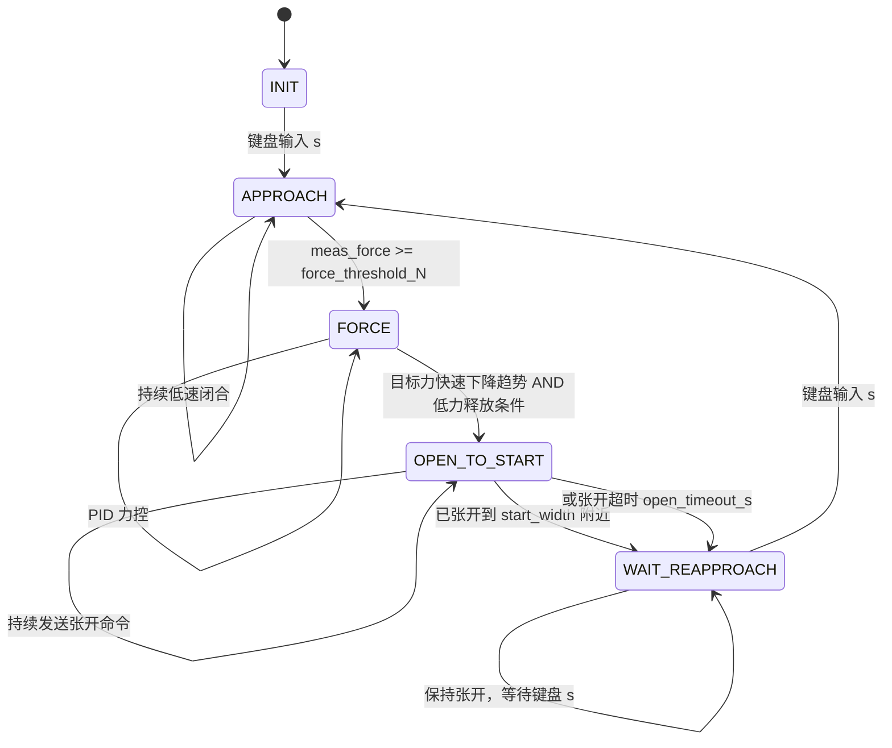

# WSG50 力控状态机改造与待定参数设计文档

## 1. 目标

当前目标是在 `wsg50_fsm_force_ctrl.py` 的基础上改造力控状态机，使其满足以下需求：

1. 夹爪释放由自动逻辑判断。
2. 释放条件必须同时满足：
   - 目标力存在整体快速下降趋势。
   - 目标力和实测力已经进入低力释放区。
3. 夹爪张开后不再自动重新 `APPROACH`。
4. 重新 `APPROACH` 只由键盘输入 `s` 触发。
5. 后续增加在线刚度估计，并根据已有刚度-PID参数表进行 PID 参数匹配。

核心原则：

```text
自动逻辑只负责判断什么时候释放并张开；
重新接近只允许人工键盘触发。
```

## 2. 新状态机设计

建议状态机改为 5 个状态：

```text
INIT
APPROACH
FORCE
OPEN_TO_START
WAIT_REAPPROACH
```

状态含义：

| 状态 | 含义 |
| --- | --- |
| `INIT` | 初始等待状态，等待第一次键盘 `s` |
| `APPROACH` | 夹爪低速闭合，直到检测到接触力 |
| `FORCE` | 根据目标力和实测力执行 PID 力控 |
| `OPEN_TO_START` | 主动张开夹爪到 `start_width_mm` |
| `WAIT_REAPPROACH` | 保持张开，等待键盘 `s` 后重新接近 |

状态机图：



ASCII 版本：

```text
┌───────────┐
│   INIT    │
└─────┬─────┘
      │ 键盘 s
      ▼
┌────────────┐
│  APPROACH  │
└─────┬──────┘
      │ meas_force >= force_threshold_N
      ▼
┌────────────┐
│   FORCE    │
└─────┬──────┘
      │
      │ 目标力快速下降趋势
      │ AND
      │ 目标力/实测力低于释放阈值
      ▼
┌────────────────┐
│ OPEN_TO_START  │
└───────┬────────┘
        │ 已张开到位 / 张开超时
        ▼
┌──────────────────┐
│ WAIT_REAPPROACH  │
└───────┬──────────┘
        │ 键盘 s
        ▼
   APPROACH
```

## 3. 状态切换逻辑

### 3.1 INIT -> APPROACH

触发条件：

```text
键盘输入 s
```

建议键盘线程不要直接修改 `self.state`，而是设置请求标志：

```python
self.reapproach_requested = True
```

然后在主循环 `_tick()` 中统一消费请求：

```python
if self.state in ("INIT", "WAIT_REAPPROACH") and self.reapproach_requested:
    self.reapproach_requested = False
    self.enter_approach()
```

这样可以避免键盘线程和控制循环同时改状态。

### 3.2 APPROACH -> FORCE

触发条件：

```python
self.meas_force is not None and self.meas_force >= self.force_threshold_N
```

进入 `FORCE` 时需要清理 PID 状态：

```python
self.int_acc = 0.0
self.prev_err = None
```

同时开始记录 FORCE 阶段曲线和性能指标。

### 3.3 FORCE -> OPEN_TO_START

触发条件必须是 AND：

```python
trend_ok and low_force_ok
```

其中：

```text
trend_ok:
    目标力在最近时间窗内存在整体快速下降趋势。

low_force_ok:
    目标力和实测力都已经低于释放阈值。
```

推荐伪代码：

```python
if self.trend_open_enable:
    trend_ok = self.target_trend_detector.is_latched(now)
else:
    trend_ok = False

low_force_ok = (
    self.target_force_raw is not None and
    self.meas_force_raw is not None and
    self.target_force_raw <= self.release_target_threshold_N and
    self.meas_force_raw <= self.release_measured_threshold_N
)

if trend_ok and low_force_ok:
    self.enter_open_to_start(reason="falling_and_low_force")
    return
```

注意：

```text
release_target_threshold_N 和 release_measured_threshold_N 不建议设得过大。
阈值越大，越容易把“高抓握力调小”误判成“松手”。
```

### 3.4 OPEN_TO_START -> WAIT_REAPPROACH

`OPEN_TO_START` 只负责主动张开，不负责自动重新 `APPROACH`。

触发条件：

```text
1. 夹爪宽度已经接近 start_width_mm
2. 或者张开超过 open_timeout_s
```

伪代码：

```python
elif self.state == "OPEN_TO_START":
    self._send_goal(self.start_width_mm, self.open_speed_mm_s)

    now_s = rospy.Time.now().to_sec()

    opened_enough = (
        self.width_mm is not None and
        self.width_mm >= self.start_width_mm - self.open_width_tol_mm
    )

    min_hold_done = (
        now_s - self.open_enter_time_s >= self.open_min_hold_s
    )

    timeout = (
        now_s - self.open_enter_time_s >= self.open_timeout_s
    )

    if (opened_enough and min_hold_done) or timeout:
        self.enter_wait_reapproach()
        return
```

旧逻辑中这一条应去掉或禁用：

```python
if self.target_force_raw >= self.open_off_threshold_N:
    self.state = "APPROACH"
```

### 3.5 WAIT_REAPPROACH -> APPROACH

触发条件：

```text
键盘输入 s
```

`WAIT_REAPPROACH` 中保持夹爪张开：

```python
elif self.state == "WAIT_REAPPROACH":
    self._send_goal(self.start_width_mm, self.hold_open_speed_mm_s)

    if self.reapproach_requested:
        self.reapproach_requested = False
        self.enter_approach()
        return
```

### 3.6 FORCE 中是否保留自动 APPROACH

当前代码中有：

```python
if self.meas_force is None or self.meas_force < self.force_threshold_N:
    self.state = "APPROACH"
```

如果目标是“重新 APPROACH 只能由键盘触发”，这条建议删除或通过参数禁用。

推荐逻辑：

```text
FORCE 状态下不再自动回 APPROACH。
如果目标力仍然较高但实测力低，PID 会继续闭合夹爪。
如果目标力下降并且进入低力区，则进入 OPEN_TO_START。
```

## 4. 目标力快速下降趋势检测

### 4.1 设计目的

目标力可能不是单调下降，而是抖动下降，例如：

```text
3.0, 2.7, 2.85, 2.4, 2.5, 2.0, 1.8, 1.9, 1.3
```

因此不能使用“连续几帧递减”作为判据。

推荐使用滑动窗口趋势检测：

```text
只判断最近一段时间内是否存在整体快速下降趋势。
允许中间存在小幅反弹。
```

### 4.2 数据缓存

每次收到目标力时，记录：

```python
(timestamp, target_abs_smooth)
```

其中目标力先取绝对值：

```python
target_abs = abs(target_raw)
```

然后做轻微 EMA 滤波：

```python
target_abs_smooth = alpha * target_abs + (1.0 - alpha) * previous
```

缓存最近 `trend_window_s` 秒的数据。

### 4.3 趋势指标

在滑动窗口内计算：

```text
start_level:
    窗口前 25% 数据的中位数。

end_level:
    窗口后 25% 数据的中位数。

drop_N:
    start_level - end_level。

drop_frac:
    drop_N / start_level。

slope:
    目标力对时间的线性拟合斜率，单位 N/s。

neg_mag_ratio:
    有效变化中，下降幅度占总变化幅度的比例。

efficiency:
    净下降量 / 总变化路径长度。
```

其中 `neg_mag_ratio` 用幅值统计，而不是步数统计：

```python
neg_mag = sum(-d for d in diffs if d < -jitter_deadband)
pos_mag = sum(d for d in diffs if d > jitter_deadband)
neg_mag_ratio = neg_mag / (neg_mag + pos_mag)
```

`efficiency`：

```python
path = sum(abs(d) for d in valid_diffs)
efficiency = drop_N / path
```

如果目标力大幅乱跳，虽然窗口末端可能低于开头，但 `efficiency` 会偏低，不会触发。

### 4.4 趋势判定

推荐判据：

```python
falling = (
    start_level >= self.trend_min_start_N and
    drop_N >= self.trend_min_drop_N and
    drop_frac >= self.trend_min_drop_frac and
    slope <= -self.trend_min_slope_N_per_s and
    neg_mag_ratio >= self.trend_min_neg_mag_ratio and
    efficiency >= self.trend_min_efficiency
)
```

再加确认时间：

```text
falling 条件连续满足 trend_confirm_s 秒后，认为趋势确认。
```

### 4.5 趋势锁存

如果严格要求 `trend_ok` 和 `low_force_ok` 同一时刻满足，可能漏检。

原因：

```text
目标力快速下降后，如果在低值附近稳定住，趋势窗口很快就不再显示“正在下降”。
而实测力可能因为机械滞后，稍晚才低于释放阈值。
```

因此建议加趋势锁存：

```text
一旦目标力下降趋势确认，trend_ok 保持 trend_latch_s 秒。
在锁存期间，如果 low_force_ok 满足，就触发 OPEN_TO_START。
```

伪代码：

```python
if falling_confirmed:
    self.trend_latched_until_s = now_s + self.trend_latch_s

trend_ok = now_s <= self.trend_latched_until_s

if trend_ok and low_force_ok:
    self.enter_open_to_start(reason="falling_and_low_force")
```

这个设计仍然满足要求：

```text
必须先检测到整体下降趋势；
并且当前目标力/实测力已经进入低力释放区。
```

## 5. 释放低力条件

不建议继续用单个 `open_on_threshold_N` 同时控制目标力和实测力。

建议拆成两个参数：

```text
release_target_threshold_N
release_measured_threshold_N
```

推荐默认：

```text
release_target_threshold_N = 0.4 N
release_measured_threshold_N = 0.8 N
```

原因：

```text
目标力是命令值，应更严格地表达“我要松开”。
实测力有机械滞后和噪声，可以稍微放宽。
```

不建议把释放阈值设得过大。

示例：

```text
release_target_threshold_N = 0.4
目标力从 5 N 调到 2 N：不会触发张开。
目标力从 5 N 降到 0.3 N：满足低目标力条件。

release_target_threshold_N = 2.0
目标力从 5 N 调到 1.8 N：可能触发张开。
这反而更容易误判“调小抓握力”为“松手”。
```

## 6. 建议新增入口函数

为了减少状态切换时的重复代码，建议增加几个入口函数。

### 6.1 enter_approach

```python
def enter_approach(self):
    self.state = "APPROACH"
    self.pos_cmd = None

    self.int_acc = 0.0
    self.prev_err = None

    self._last_send_t = rospy.Time(0)
    self._last_send_w = None
    self._last_send_v = None

    if self.trend_detector is not None:
        self.trend_detector.reset()
```

### 6.2 enter_open_to_start

```python
def enter_open_to_start(self, reason):
    self.state = "OPEN_TO_START"
    self.open_reason = reason
    self.open_enter_time_s = rospy.Time.now().to_sec()

    self.int_acc = 0.0
    self.prev_err = None
    self.pos_cmd = None

    self._last_send_t = rospy.Time(0)
    self._last_send_w = None
    self._last_send_v = None
```

### 6.3 enter_wait_reapproach

```python
def enter_wait_reapproach(self):
    self.state = "WAIT_REAPPROACH"
    self.wait_reapproach_enter_time_s = rospy.Time.now().to_sec()
    self.reapproach_requested = False
```

## 7. Debug 输出建议

建议在 debug topic 中增加以下字段：

```text
state
open_reason
reapproach_requested
meas_raw
meas_f
target_raw
target_f
release_low_ok
trend_drop_N
trend_drop_frac
trend_slope_N_per_s
trend_neg_mag_ratio
trend_efficiency
trend_falling
trend_latched
```

这样现场可以直接判断：

```text
是否检测到了下降趋势？
低力条件是否满足？
是否因为 falling_and_low_force 进入 OPEN_TO_START？
是否已经进入 WAIT_REAPPROACH？
键盘 s 是否被主循环接收？
```

## 8. 在线刚度估计与 PID 参数调度

### 8.1 是否可行

可行，但建议分两步：

```text
第一步：只在线估计刚度并发布 debug，不自动改 PID。
第二步：确认估计结果稳定后，再启用 PID 参数调度。
```

### 8.2 刚度定义

夹爪闭合时：

```text
width 变小，力变大。
```

可以定义压缩量：

```python
compression_mm = start_width_mm - width_mm
```

刚度：

```python
stiffness_N_per_mm = dF / d(compression_mm)
```

如果直接用 `width_mm` 拟合：

```text
F = a * width_mm + b
stiffness_N_per_mm = -a
```

### 8.3 刚度估计方法

不要直接使用单个：

```text
ΔF / Δx
```

因为噪声会很大。

推荐在 `FORCE` 状态下记录最近 `stiffness_window_s` 秒：

```python
(t, width_mm, meas_force_f)
```

然后做线性拟合：

```text
F = a * width_mm + b
k = -a
```

有效性检查：

```text
窗口时间足够长
样本数足够多
width 变化量 >= stiffness_min_width_span_mm
force 变化量 >= stiffness_min_force_span_N
拟合 R2 >= stiffness_fit_r2_min
k > 0
k 在合理范围内
当前处于 FORCE 状态
```

### 8.4 PID 参数匹配

准备已有表：

```python
stiffness_pid_table = [
    {"k": 0.2, "kp": 0.20, "ki": 0.00, "kd": 0.00},
    {"k": 0.5, "kp": 0.15, "ki": 0.00, "kd": 0.01},
    {"k": 1.0, "kp": 0.10, "ki": 0.00, "kd": 0.02},
    {"k": 2.0, "kp": 0.06, "ki": 0.00, "kd": 0.03},
]
```

匹配建议用 log 距离：

```python
best = min(table, key=lambda row: abs(math.log(k_est) - math.log(row["k"])))
```

原因：

```text
刚度可能跨数量级，用 log 距离比普通线性距离更合理。
```

第一版建议用最邻近匹配，不建议一开始做连续插值。

### 8.5 PID 切换保护

不要每帧切换 PID。

建议增加：

```text
stiffness_lpf_alpha
stiffness_update_period_s
pid_switch_min_ratio
pid_param_smooth_alpha
```

切换 PID 时：

```python
self.prev_err = None
```

如果 `ki` 非零，建议清理或限制积分：

```python
self.int_acc = clamp(self.int_acc, -limit, limit)
```

## 9. 建议新增参数清单

### 9.1 手动重新 APPROACH 与张开状态参数

| 参数 | 推荐默认值 | 说明 |
| --- | --- | --- |
| `manual_reapproach_only` | `True` | 张开后只允许键盘 `s` 重新 APPROACH |
| `open_speed_mm_s` | `50.0` | 主动张开速度 |
| `hold_open_speed_mm_s` | `30.0` | WAIT_REAPPROACH 中保持张开的命令速度 |
| `open_width_tol_mm` | `2.0` | 判定已经张开到位的宽度容差 |
| `open_min_hold_s` | `0.25` | 张开后至少保持时间 |
| `open_timeout_s` | `2.0` | 张开超时兜底 |

### 9.2 释放低力条件参数

| 参数 | 推荐默认值 | 说明 |
| --- | --- | --- |
| `release_target_threshold_N` | `0.4` | 目标力低于该值才认为存在释放意图 |
| `release_measured_threshold_N` | `0.8` | 实测力低于该值才允许张开 |
| `release_low_confirm_s` | `0.05` | 低力条件确认时间 |

### 9.3 目标力下降趋势参数

| 参数 | 推荐默认值 | 说明 |
| --- | --- | --- |
| `trend_open_enable` | `True` | 是否启用目标力下降趋势检测 |
| `trend_window_s` | `0.6` | 趋势检测滑动窗口长度 |
| `trend_min_window_s` | `0.30` | 至少有多长数据才开始判断 |
| `trend_min_samples` | `6` | 最少样本数 |
| `trend_smooth_alpha` | `0.45` | 目标力趋势检测用 EMA 滤波系数 |
| `trend_jitter_deadband_N` | `0.05` | 小于该幅度的变化视为抖动 |
| `trend_min_start_N` | `0.8` | 窗口起始目标力太低时不触发 |
| `trend_min_drop_N` | `0.4` | 窗口内最小净下降量 |
| `trend_min_drop_frac` | `0.25` | 相对起点的最小下降比例 |
| `trend_min_slope_N_per_s` | `0.8` | 最小下降斜率 |
| `trend_min_neg_mag_ratio` | `0.65` | 下降幅值占总有效变化的最小比例 |
| `trend_min_efficiency` | `0.35` | 净下降量 / 总路径长度 |
| `trend_confirm_s` | `0.10` | 趋势确认时间 |
| `trend_latch_s` | `0.8` | 趋势确认后的锁存时间 |
| `trend_cooldown_s` | `0.8` | 趋势触发冷却时间 |

### 9.4 在线刚度估计参数

| 参数 | 推荐默认值 | 说明 |
| --- | --- | --- |
| `stiffness_enable` | `False` | 第一版建议只 debug，不自动启用 |
| `stiffness_window_s` | `0.8` | 刚度估计窗口长度 |
| `stiffness_min_window_s` | `0.3` | 最小有效窗口时间 |
| `stiffness_min_samples` | `8` | 最少样本数 |
| `stiffness_min_width_span_mm` | `0.05` | 窗口内最小宽度变化 |
| `stiffness_min_force_span_N` | `0.1` | 窗口内最小力变化 |
| `stiffness_fit_r2_min` | `0.6` | 线性拟合最小 R2 |
| `stiffness_lpf_alpha` | `0.25` | 刚度估计低通滤波 |
| `stiffness_update_period_s` | `0.3` | 刚度估计/调度更新周期 |
| `stiffness_min_N_per_mm` | `0.01` | 刚度下限 |
| `stiffness_max_N_per_mm` | `20.0` | 刚度上限 |

### 9.5 PID 参数调度参数

| 参数 | 推荐默认值 | 说明 |
| --- | --- | --- |
| `pid_schedule_enable` | `False` | 第一版建议关闭，只观察刚度 |
| `pid_schedule_mode` | `"nearest"` | 最邻近搜索 |
| `pid_switch_min_ratio` | `1.3` | 新旧刚度档位差异足够大才切换 |
| `pid_param_smooth_alpha` | `0.2` | PID 参数平滑切换系数 |

## 10. 需要自行检测的参数

### 10.1 话题频率

需要测：

```text
1. /znsv6_cmd/act2 发布频率
2. /znsv6_data_sensor2 发布频率
3. /wsg_50_driver/status 发布频率
```

Ubuntu 终端命令：

```bash
rostopic hz /znsv6_cmd/act2
rostopic hz /znsv6_data_sensor2
rostopic hz /wsg_50_driver/status
```

### 10.2 目标力趋势相关

需要记录和对照的当前代码值：

1. 目标力稳定时的抖动范围
   - 当前实测值：未实测。
   - 当前代码值：`trend_jitter_deadband_N = 0.05 N`。
   - 物理意义：目标力变化小于约 `0.05 N` 时，趋势检测把它当作抖动，不计入有效下降。

2. 典型松手下降幅度
   - 当前实测值：未实测。
   - 当前代码值：`trend_min_drop_N = 0.55 N`。
   - 物理意义：滑动窗口内目标力净下降至少达到 `0.55 N`，才可能被认为是松手/释放趋势。

3. 典型松手下降持续时间
   - 当前实测值：未实测。
   - 当前代码值：`trend_window_s = 0.6 s`，`trend_min_window_s = 0.35 s`，`trend_min_samples = 10`。
   - 物理意义：控制器最多看最近 `0.6 s` 的目标力变化。
     至少积累 `0.35 s` 且 `10` 个样本后才开始判断趋势。

4. 希望下降开始后多久张开
   - 当前实测值：未实测。
   - 当前代码值：`trend_confirm_s = 0.08 s`，FSM 频率约 `30 Hz`。
   - 物理意义：下降趋势需要连续满足约 `80 ms` 才确认。
     实际张开延迟还会叠加目标力滤波、FSM tick 和命令发送延迟。

5. 高抓握力调小但不松手时，目标力最低会调到多少
   - 当前实测值：未实测。
   - 当前代码值：`release_target_threshold_N = 0.4 N`。
   - 物理意义：这是“低目标力”的观察阈值。
     默认 `release_gate_mode = trend_only` 时，它主要用于 debug/观察，不是张开的硬性门槛。

6. 真正希望张开时，目标力一般会低于多少
   - 当前实测值：未实测。
   - 当前代码值：`release_target_threshold_N = 0.4 N`。
   - 物理意义：如果真松手时目标力通常低于 `0.4 N`，这个阈值可作为释放意图参考。
     若实际数据高于或低于它，需要按实验调整。

7. 下降过程中典型反弹幅度
   - 当前实测值：未实测。
   - 当前代码值：`trend_neg_mag_ratio = 0.70`，`trend_min_efficiency = 0.45`。
   - 物理意义：下降过程不能来回震荡太多。
     有效下降幅值需要占主导，净下降量不能只来自一段很曲折的抖动轨迹。

说明：这些“当前代码值”是控制器默认阈值，不是 rosbag 或真机实验测得的物理数据。
后续应优先用实验数据回填“当前实测值”，再反推这些阈值是否合适。

建议记录的实验场景：

```text
A. 稳定抓握，不松手
B. 高抓握力调小，但不希望张开
C. 真正松手，目标力快速下降到低值
D. 目标力下降后保持低值
```

### 10.3 实测力释放相关

需要记录和对照的当前代码值：

1. 实测力稳定时噪声范围
   - 当前实测值：未实测。
   - 当前代码值：`force_lpf_alpha = 0.3`。
   - 物理意义：这是实测力低通滤波系数，新采样占 `30%`。它能减小噪声影响，但不等于真实噪声幅度。

2. 低力区实测力噪声范围
   - 当前实测值：未实测。
   - 当前代码值：`release_measured_threshold_N = 0.8 N`。
   - 物理意义：实测力低于 `0.8 N` 时，会被当作“低实测力”观察条件。
     真实低力区噪声应明显小于这个阈值。

3. 目标力下降后，实测力滞后多久才下降到低力区
   - 当前实测值：未实测。
   - 当前代码值：`release_measured_low_confirm_s = 0.12 s`，`release_intent_timeout_s = 1.5 s`。
   - 物理意义：实测力低于阈值需要持续 `0.12 s` 才确认；目标力下降形成的释放意图最多保留 `1.5 s`。

4. 真正松手时，实测力一般低于多少
   - 当前实测值：未实测。
   - 当前代码值：`release_measured_threshold_N = 0.8 N`，`force_contact_lost_threshold_N = 0.075 N`。
   - 物理意义：`0.8 N` 是低力观察阈值；`0.075 N` 是 FORCE 中判定失接触的更低阈值。

5. 调小抓握力但不松手时，实测力最低可能到多少
   - 当前实测值：未实测。
   - 当前代码值：`release_measured_threshold_N = 0.8 N`。
   - 物理意义：如果“不松手”场景下实测力也会低于 `0.8 N`，这个阈值就可能过高。
     此时需要按实验下调阈值，或增加其他判据。

这些数据用于设置：

```text
release_measured_threshold_N
trend_latch_s（当前代码中对应 release_intent_timeout_s = 1.5 s）
release_low_confirm_s（当前代码中拆成 release_target_low_confirm_s = 0.08 s，release_measured_low_confirm_s = 0.12 s）
```

说明：这些“当前代码值”是控制器默认阈值，不是实测力传感器噪声或真实释放滞后的实验数据。

### 10.4 张开动作相关

需要记录和对照的当前代码值：

1. 夹爪从典型抓握宽度张开到 `start_width_mm` 需要多久
   - 当前实测值：未实测。
   - 当前代码值：`open_speed_mm_s = 50.0 mm/s`，`open_timeout_s = 3.0 s`。
   - 物理意义：张开耗时大致由“张开距离 / 张开速度”决定；`3.0 s` 是兜底超时，应大于真实张开耗时。

2. `width_mm` 反馈是否稳定可靠
   - 当前实测值：未实测。
   - 当前代码值：`status_stale_timeout_s = 0.50 s`。
   - 物理意义：超过 `0.50 s` 没有新的夹爪状态，控制器认为宽度反馈无效。
     这只检查超时，不检查噪声和跳变。

3. 到达 `start_width_mm` 附近时的宽度误差
   - 当前实测值：未实测。
   - 当前代码值：`open_width_tol_mm = 2.0 mm`。
   - 物理意义：宽度达到目标宽度下方 `2.0 mm` 以内，就认为“足够张开”。

4. 可以接受的张开完成容差
   - 当前代码值：`open_width_tol_mm = 2.0 mm`，`open_min_hold_s = 0.25 s`。
   - 物理意义：完成判定不仅看宽度容差。
     也要求进入张开状态后至少经过 `0.25 s`，避免刚进入张开就立刻切状态。

这些数据用于设置：

```text
open_speed_mm_s
open_width_tol_mm
open_timeout_s
open_min_hold_s
```

说明：`start_width_mm` 当前默认是 `110.0 mm`。
但 `open_limit_protect_enable = True` 且 `open_limit_margin_mm = 1.0 mm` 时，
实际张开目标会被保护到约 `max_width_mm - 1.0 = 109.0 mm`。
这些“当前代码值”不是张开耗时、反馈噪声或到位误差的实测结果。

### 10.5 在线刚度相关

需要记录：

```text
1. FORCE 状态下 width_mm 的变化范围：约 ___ mm
2. FORCE 状态下实测力变化范围：约 ___ N
3. 软物体估计刚度范围：约 ___ N/mm
4. 硬物体估计刚度范围：约 ___ N/mm
5. 你已有的刚度-PID参数表
6. 希望刚度只用于 debug，还是自动切 PID
7. PID 参数希望离散切档，还是后续做插值
```

## 11. 参数设置经验规则

趋势检测：

```text
trend_jitter_deadband_N ≈ 目标力稳定抖动幅度的 1 到 2 倍

trend_min_drop_N ≈ 典型松手下降幅度的 30% 到 60%
但必须明显大于普通抖动

trend_min_slope_N_per_s ≈ trend_min_drop_N / trend_window_s

trend_latch_s 应大于“目标力下降到低值”到“实测力下降到低值”的滞后时间
```

释放阈值：

```text
release_target_threshold_N 应低于“调小但不松手”的最低目标力

release_measured_threshold_N 可比 release_target_threshold_N 大一些
因为实测力有机械滞后和噪声
```

张开判断：

```text
open_timeout_s 应大于典型张开耗时

open_width_tol_mm 应略大于 width_mm 到位误差和反馈噪声
```

刚度估计：

```text
stiffness_min_width_span_mm 应大于位置反馈噪声

stiffness_min_force_span_N 应大于力传感器噪声

stiffness_window_s 太短会噪，太长会滞后
第一版建议 0.5 到 1.0 s
```

## 12. 推荐实施顺序

### 阶段 1：状态机改造

实现：

```text
INIT / APPROACH / FORCE / OPEN_TO_START / WAIT_REAPPROACH
```

完成：

```text
张开后进入 WAIT_REAPPROACH
重新 APPROACH 只由键盘 s 触发
禁用 OPEN_TO_START -> APPROACH 的自动跳转
视需求禁用 FORCE -> APPROACH 的自动跳转
```

### 阶段 2：趋势检测接入 debug

实现目标力下降趋势检测器，但先只 debug，不触发张开。

观察：

```text
trend_drop_N
trend_slope_N_per_s
trend_neg_mag_ratio
trend_efficiency
trend_falling
trend_latched
```

### 阶段 3：启用趋势 AND 低力释放

启用：

```python
if trend_ok and low_force_ok:
    enter_open_to_start("falling_and_low_force")
```

重点测试：

```text
高抓握力调小但不松手时，不应张开。
真正松手时，应张开。
张开后必须等待键盘 s 才重新 APPROACH。
```

### 阶段 4：在线刚度估计

先只估计并 debug：

```text
stiffness_est_N_per_mm
stiffness_fit_r2
stiffness_valid
```

不自动改 PID。

### 阶段 5：PID 参数调度

在刚度估计稳定后，再启用：

```text
刚度最邻近匹配 PID 参数
PID 参数平滑切换
切换时清理微分状态，必要时限制积分
```

## 13. 第一版推荐默认值

如果暂时没有实测数据，可以先用：

```text
manual_reapproach_only = True

open_speed_mm_s = 50.0
hold_open_speed_mm_s = 30.0
open_width_tol_mm = 2.0
open_min_hold_s = 0.25
open_timeout_s = 2.0

release_target_threshold_N = 0.4
release_measured_threshold_N = 0.8
release_low_confirm_s = 0.05

trend_open_enable = True
trend_window_s = 0.6
trend_min_window_s = 0.30
trend_min_samples = 6
trend_smooth_alpha = 0.45
trend_jitter_deadband_N = 0.05
trend_min_start_N = 0.8
trend_min_drop_N = 0.4
trend_min_drop_frac = 0.25
trend_min_slope_N_per_s = 0.8
trend_min_neg_mag_ratio = 0.65
trend_min_efficiency = 0.35
trend_confirm_s = 0.10
trend_latch_s = 0.8
trend_cooldown_s = 0.8

stiffness_enable = False
pid_schedule_enable = False
```

## 14. 当前最重要的待确认问题

实现前建议确认：

```text
1. 是否确定删除或禁用 FORCE -> APPROACH 的自动跳转？
2. 键盘 s 是否只在 INIT 和 WAIT_REAPPROACH 有效？
3. OPEN_TO_START 中按 s 是否忽略，还是记录 pending？
4. release_target_threshold_N 和 release_measured_threshold_N 的初始值是否接受 0.4 / 0.8？
5. 在线刚度第一版是否只 debug，不自动调 PID？
```

建议答案：

```text
1. 是，禁用 FORCE -> APPROACH 自动跳转。
2. 是，只在 INIT 和 WAIT_REAPPROACH 有效。
3. 第一版忽略 OPEN_TO_START 中的 s。
4. 先用 0.4 / 0.8，后续按实测调整。
5. 是，刚度第一版只 debug。
```
