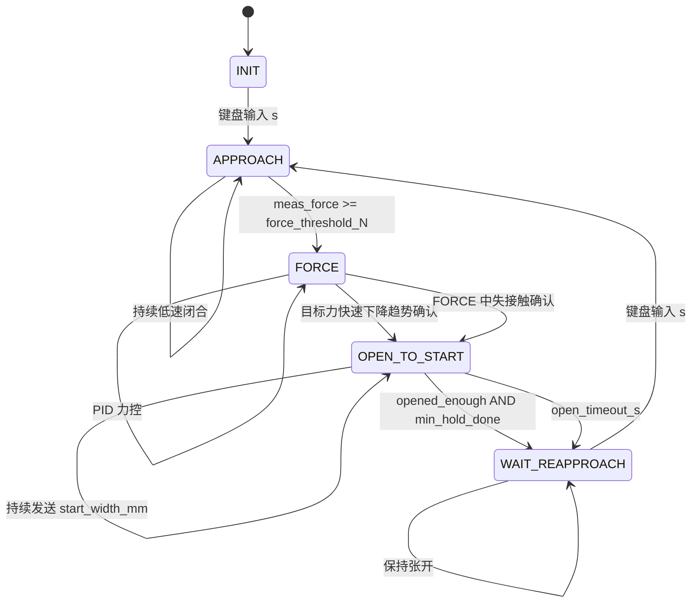

# WSG50 力控状态机改造方案 v2

日期：2026-06-08

本文档是在 `wsg50_fsm_force_ctrl_design.md` 的基础上，结合后续评审意见整理出的新版方案。

本版本仍然遵循原核心原则：

```text
自动逻辑只负责释放并张开；
重新 APPROACH 只允许人工键盘触发。
```

同时补充以下保护：

```text
1. 释放意图锁存，避免实测力滞后导致漏触发。
2. 低力判断使用专门释放判断量，不直接使用原始 raw。
3. 趋势检测只服务 FORCE 阶段，避免接触前的下降被误用。
4. WAIT_REAPPROACH 中按 s 的语义与 INIT 中一致：只要按 s 就进入 APPROACH。
5. FORCE 中失接触不再自动 APPROACH，而是进入 OPEN_TO_START。
6. OPEN_TO_START 超时要区分张开完成和张开失败。
7. 增加 topic staleness 检查和更完整 debug。
```

---

## 1. 对评审建议的采纳结论

### 1.1 建议采纳

以下建议值得采纳，并应进入第一版状态机改造：

| 建议 | 采纳理由 |
| --- | --- |
| 将 `trend_latch` 升级为 `release_intent_latched` | 语义更清楚：趋势检测识别的是“释放意图”，低力判断识别的是“允许张开”。可以避免目标力下降和实测力下降不同步导致漏触发。 |
| 低力判断不用 raw，目标力用 `abs(raw)`，实测力用滤波后非负值 | 避免负目标力、实测力负向噪声、瞬时尖峰导致误判。 |
| 目标低力确认和实测低力确认拆开 | 目标力是命令，响应快；实测力有滞后和噪声，应使用不同确认时间。 |
| 趋势检测只在 `FORCE` 阶段生效 | 避免 `INIT` 或 `APPROACH` 阶段的目标力下降被带入 FORCE 后误触发释放。 |
| `WAIT_REAPPROACH -> APPROACH` 与 `INIT -> APPROACH` 保持同一语义 | 只要人工按 `s`，就开始闭合；不再额外检查目标力门槛。 |
| FORCE 中失接触确认后进入 `OPEN_TO_START` | 失接触说明当前接触/夹持过程已经不稳定，直接张开并等待人工重新接近，状态语义更清楚。 |
| `OPEN_TO_START` 超时后记录 `open_failed` | 超时不等于张开成功，现场 debug 需要区分。 |
| 趋势滤波改用时间常数 `tau` | 避免 topic 频率变化导致滤波行为改变。 |
| 增加 staleness 检查 | 防止目标力、实测力、宽度反馈停更时触发错误状态切换。 |
| 键盘线程只置标志，主 tick 消费 | 避免多线程直接改状态。 |
| 状态切换入口函数中统一重置 PID、趋势检测、发送缓存 | 降低状态切换残留状态导致的问题。 |

### 1.2 部分采纳

以下建议有价值，但第一版应谨慎启用：

| 建议 | 处理方式 |
| --- | --- |
| 实测力长时间不低时允许 bypass 张开 | 先只做 debug，不默认启用。这个逻辑可能在仍有较大夹持力时张开，风险较高。 |
| 低力持续一段时间也释放，不要求快速下降趋势 | 默认关闭。当前第一版需求明确是 `trend_only`，低力只做 debug。 |
| OPEN_TO_START 中按 `s` 记录 pending | 第一版先忽略 OPEN_TO_START 中的 `s`，只记录 `ignored_s_count` 和 `last_s_time_s`。 |
| 在线刚度估计与 PID 调度 | 刚度估计可以做 debug，但不要和释放状态机第一版同时启用 PID 自动调度。 |
| PID 参数插值 | 第一版如果做调度，只考虑最邻近；插值放后续。 |

### 1.3 暂不采纳

以下建议暂不进入第一版：

| 建议 | 暂不采纳理由 |
| --- | --- |
| 默认启用 `release_allow_measured_timeout_bypass` | 可能在实测力仍然较大时强制张开，第一版不建议默认打开。 |
| 默认启用 `low_force_only_release_enable` | 会绕过“快速下降趋势”这一核心判断，可能把慢速调小误判为释放。 |
| 同一阶段启用状态机改造、趋势释放、刚度 PID 调度 | 难以定位问题来源，应按阶段推进。 |

---

## 2. 新版更改模块分类

新版方案建议拆成 9 个模块。

### 模块 A：状态机结构改造

新增 `WAIT_REAPPROACH`，形成 5 状态：

```text
INIT
APPROACH
FORCE
OPEN_TO_START
WAIT_REAPPROACH
```

目标：

```text
张开后不自动重新 APPROACH；
重新 APPROACH 只由键盘 s 触发。
```

### 模块 B：键盘请求与人工重新 APPROACH

键盘线程不直接改 `self.state`。

键盘线程只设置：

```python
self.reapproach_requested = True
```

主 FSM tick 根据当前状态决定是否消费。

### 模块 C：释放意图检测

目标力下降趋势不再直接等价于张开。

它只产生：

```text
release_intent_latched
```

也就是“检测到释放意图”。

### 模块 D：低力释放观察

第一版先关闭低力释放门槛。

```text
FORCE -> OPEN_TO_START 主要由目标力快速下降趋势触发。
```

低力判断仍保留为 debug 字段，用于观察目标力/实测力是否进入低力区；后续如果 `trend_only` 误触发较多，再考虑切换到 `trend_and_target_low` 或 `trend_and_low_force`。

### 模块 E：FORCE 内失接触转张开

禁用 `FORCE -> APPROACH` 自动跳转后，如果实测力低于接触阈值并持续超过确认时间，状态切换到 `OPEN_TO_START`。

这表示：

```text
FORCE 中如果失去接触，不再重新闭合寻找接触；
而是张开并进入 WAIT_REAPPROACH，等待人工按 s 重新开始。
```

### 模块 F：OPEN_TO_START 张开诊断

`OPEN_TO_START` 中持续发送张开命令。

退出到 `WAIT_REAPPROACH` 的原因要记录：

```text
opened_enough
timeout
open_failed
width_stale
```

### 模块 G：数据有效性检查

目标力、实测力、宽度反馈都需要 timestamp 和 stale 判断。

stale 时不能触发释放。

### 模块 H：debug 输出

debug topic 增加释放意图、低力确认、趋势指标、stale、张开失败等字段。

### 模块 I：在线刚度估计与 PID 调度

后续模块。

第一版建议：

```text
只做刚度估计 debug；
不自动切换 PID。
```

---

## 3. 新版状态机

### 3.1 状态机图



### 3.2 ASCII 图

```text
┌───────────┐
│   INIT    │
└─────┬─────┘
      │ 键盘 s
      ▼
┌────────────┐
│  APPROACH  │
└─────┬──────┘
      │ meas_force >= force_threshold_N
      ▼
┌────────────┐
│   FORCE    │
└─────┬──────┘
      │
      │ 目标力快速下降趋势确认
      │ 或 FORCE 中失接触确认
      ▼
┌────────────────┐
│ OPEN_TO_START  │
└───────┬────────┘
        │ opened_enough / timeout
        ▼
┌──────────────────┐
│ WAIT_REAPPROACH  │
└───────┬──────────┘
        │ 键盘 s
        ▼
   APPROACH
```

---

## 4. 释放触发逻辑

### 4.1 总体条件

第一版释放触发模式使用：

```text
release_gate_mode = "trend_only"
```

也就是：

```python
if falling_confirmed:
    self.enter_open_to_start(reason="target_falling")
    return
```

含义：

```text
只要目标力快速下降趋势被确认，就认为上游策略表达了释放/张开意图。
低力释放区暂时不作为门槛。
```

推荐 FORCE 伪代码：

```python
elif self.state == "FORCE":
    now_s = rospy.Time.now().to_sec()

    snapshot = self._get_sensor_snapshot(now_s)

    target_valid = (
        snapshot.target_abs_raw is not None and
        not snapshot.target_stale
    )

    meas_valid = (
        snapshot.meas_force_f is not None and
        not snapshot.meas_stale
    )

    if target_valid:
        falling_confirmed, trend_metrics = self.target_trend_detector.update_and_check(
            now_s,
            snapshot.target_abs_raw
        )

        if falling_confirmed:
            self.release_intent_latched = True
            self.release_intent_until_s = now_s + self.release_intent_timeout_s
            self.release_intent_reason = "target_falling"

    release_intent_ok = (
        self.release_intent_latched and
        now_s <= self.release_intent_until_s
    )

    # 低力条件第一版只更新 debug，不参与触发。
    low_force_ok = self._update_release_low_condition(now_s, snapshot)

    if target_valid and self.release_gate_mode == "trend_only" and release_intent_ok:
        self.enter_open_to_start(reason="target_falling")
        return

    # 可选保守模式，默认不启用。
    if target_valid and meas_valid and self.release_gate_mode == "trend_and_low_force" \
       and release_intent_ok and low_force_ok:
        self.enter_open_to_start(reason="falling_and_low_force")
        return

    if self._force_contact_lost_confirmed(now_s, snapshot):
        self.enter_open_to_start(reason="contact_lost")
        return

    self._run_force_pid(now_s, snapshot)
```

### 4.2 为什么第一版关闭低力释放门槛

你录到的 CSV 中，目标力在高力区出现明显快速下降，例如约 `0.6 s` 内下降 `0.56~0.80 N`，斜率约 `-1.15~-1.68 N/s`。

```text
这类高力区快速下降就是当前想要的释放/张开触发。
```

因此第一版不要求：

```text
target_low_confirmed
measured_low_confirmed
```

否则会把这类高力区下降挡掉。

低力条件仍保留在 debug 中，后续如果发现 `trend_only` 误触发，再切换为更保守模式。

---

## 5. 目标力下降趋势检测

### 5.1 生效范围

趋势检测只服务 FORCE 阶段。

推荐实现方式：

```text
APPROACH -> FORCE 时 reset 趋势检测器；
只在 FORCE 状态下 update/check 趋势。
```

这样可以避免：

```text
INIT 或 APPROACH 阶段目标力下降；
进入 FORCE 后立即误用旧趋势。
```

### 5.2 滤波方式

建议不用固定 `trend_smooth_alpha` 作为第一选择，而使用时间常数：

```python
alpha = 1.0 - math.exp(-dt / self.trend_filter_tau_s)
target_smooth = alpha * target_abs + (1.0 - alpha) * target_smooth_prev
```

参数：

```text
trend_use_time_constant_filter = True
trend_filter_tau_s = 0.08
```

优点：

```text
目标力 topic 从 30 Hz 变成 10 Hz 时，滤波动态不会大幅改变。
```

### 5.3 趋势指标

窗口内保存：

```python
(t, target_abs_smooth)
```

只保留最近：

```text
trend_window_s
```

计算：

```text
start_level：
    窗口前 25% 数据的中位数

end_level：
    窗口后 25% 数据的中位数

drop_N：
    start_level - end_level

drop_frac：
    drop_N / max(start_level, eps)

slope_N_per_s：
    目标力对时间的线性拟合斜率

neg_mag_ratio：
    有效变化中，下降幅值 / 总有效变化幅值

efficiency：
    净下降量 / 总路径长度
```

有效变化：

```python
abs(diff) > trend_jitter_deadband_N
```

### 5.4 趋势确认条件

```python
falling = (
    start_level >= self.trend_min_start_N and
    drop_N >= self.trend_min_drop_N and
    drop_frac >= self.trend_min_drop_frac and
    slope_N_per_s <= -self.trend_min_slope_N_per_s and
    neg_mag_ratio >= self.trend_min_neg_mag_ratio and
    efficiency >= self.trend_min_efficiency
)
```

再要求连续满足：

```text
trend_confirm_s
```

确认后只设置释放意图：

```python
self.release_intent_latched = True
self.release_intent_until_s = now_s + self.release_intent_timeout_s
```

在第一版 `trend_only` 模式下，释放意图确认后会立即触发 `OPEN_TO_START`。

推荐基于已录 CSV 的第一版趋势参数：

```text
trend_window_s = 0.6
trend_min_window_s = 0.35
trend_min_samples = 10
trend_filter_tau_s = 0.08
trend_jitter_deadband_N = 0.05

trend_min_drop_N = 0.55
trend_min_drop_frac = 0.12
trend_min_slope_N_per_s = 1.0
trend_min_neg_mag_ratio = 0.70
trend_min_efficiency = 0.45
trend_confirm_s = 0.08
```

---

## 6. 低力释放观察

### 6.1 判断量

不直接使用原始 raw 做低力判断。

目标释放判断量：

```python
target_release_N = abs(self.target_force_raw)
```

实测释放判断量：

```python
meas_release_N = self.meas_force_f
```

其中 `meas_force_f` 应该已经是：

```text
measured_scale 后
负数归零
EMA 滤波后
```

### 6.2 低力条件

```python
target_low_now = (
    target_release_N is not None and
    target_release_N <= self.release_target_threshold_N
)

measured_low_now = (
    meas_release_N is not None and
    meas_release_N <= self.release_measured_threshold_N
)
```

然后分别确认：

```python
target_low_confirmed = self.target_low_timer.update(
    target_low_now,
    now_s,
    self.release_target_low_confirm_s
)

measured_low_confirmed = self.measured_low_timer.update(
    measured_low_now,
    now_s,
    self.release_measured_low_confirm_s
)

low_force_ok = target_low_confirmed and measured_low_confirmed
```

第一版中：

```text
low_force_ok 只用于 debug，不参与 FORCE -> OPEN_TO_START 触发。
```

保留它的原因：

```text
1. 现场可以观察目标力/实测力是否进入低力区。
2. 后续如果 trend_only 误触发，可以切换到 trend_and_target_low 或 trend_and_low_force。
3. 不需要重写数据处理逻辑。
```

### 6.3 推荐默认值

```text
release_target_threshold_N = 0.4
release_measured_threshold_N = 0.8
release_target_low_confirm_s = 0.08
release_measured_low_confirm_s = 0.12
```

解释：

```text
目标力是命令值，应更严格。
实测力有滞后和噪声，可以稍放宽。
实测力确认时间应比目标力确认时间稍长。
```

---

## 7. 释放意图与触发模式

### 7.1 触发模式

建议做成可切换模式：

```text
release_gate_mode = "trend_only"
```

可选：

```text
trend_only:
    目标力快速下降趋势确认后直接张开。
    第一版使用这个模式。

trend_and_target_low:
    目标力快速下降趋势确认，并且目标力进入低力区后才张开。

trend_and_low_force:
    目标力快速下降趋势确认，并且目标力/实测力都进入低力区后才张开。
```

### 7.2 释放意图超时

虽然 `trend_only` 模式下通常会立即张开，但仍可以保留释放意图超时，用于 debug 或后续保守模式：

```python
release_intent_ok = (
    self.release_intent_latched and
    now_s <= self.release_intent_until_s
)
```

推荐：

```text
release_intent_timeout_s = 1.5
```

在 `trend_only` 模式下，`release_intent_timeout_s` 不是主要门槛；主要用于避免意图状态长期残留。

---

## 8. WAIT_REAPPROACH 的人工重新接近

### 8.1 键盘 s 的有效状态

第一版建议：

```text
s 只在 INIT 和 WAIT_REAPPROACH 有效。
OPEN_TO_START 中按 s 忽略。
APPROACH 和 FORCE 中按 s 忽略。
```

被忽略时记录：

```text
ignored_s_count
last_s_time_s
last_ignored_s_state
```

### 8.2 WAIT_REAPPROACH 中按 s 的语义

你的当前设计要求：

```text
WAIT_REAPPROACH -> APPROACH
与
INIT -> APPROACH
保持同一语义。
```

也就是：

```text
只要按 s，就开始闭合。
不检查目标力是否大于某个门槛。
```

伪代码：

```python
elif self.state == "WAIT_REAPPROACH":
    self._send_goal(self.start_width_mm, self.hold_open_speed_mm_s)

    if self.reapproach_requested:
        self.reapproach_requested = False

        self.enter_approach()
        return
```

进入 `APPROACH` 后，逻辑与第一次启动相同：

```text
夹爪低速闭合；
当 meas_force >= force_threshold_N 时进入 FORCE。
```

---

## 9. FORCE 中失接触进入 OPEN_TO_START

### 9.1 旧逻辑

当前代码中存在：

```python
if self.meas_force is None or self.meas_force < self.force_threshold_N:
    self.state = "APPROACH"
    return
```

新版目标是：

```text
重新 APPROACH 只由键盘触发。
```

所以这条自动跳转不能继续跳回 `APPROACH`。

### 9.2 新行为

你的当前设计要求：

```text
FORCE 中如果实测力低于接触阈值并持续确认，
不在 FORCE 中继续闭合，
也不回 APPROACH，
而是进入 OPEN_TO_START。
```

### 9.3 新保护

用确认时间避免瞬时力噪声导致误触发：

伪代码：

```python
contact_lost_now = (
    self.meas_force_f is not None and
    self.meas_force_f < self.force_threshold_N
)

contact_lost_confirmed = self.contact_lost_timer.update(
    contact_lost_now,
    now_s,
    self.force_contact_lost_confirm_s
)

if contact_lost_confirmed:
    self.enter_open_to_start(reason="contact_lost")
    return
```

推荐参数：

```text
force_contact_lost_to_open_enable = True
force_contact_lost_confirm_s = 0.15
```

这个语义更直接：

```text
FORCE 中失接触 = 当前抓握/接触过程结束或不稳定；
先张开，等待人工重新开始。
```

---

## 10. OPEN_TO_START 逻辑

### 10.1 进入时重置

进入 `OPEN_TO_START` 时：

```python
self.open_reason = reason
self.open_enter_time_s = now_s
self.open_failed = False
self.opened_enough = False

self.int_acc = 0.0
self.prev_err = None
self.prev_pid_time_s = None
self.pos_cmd = None

self._reset_send_cache()
```

### 10.2 状态中行为

```python
elif self.state == "OPEN_TO_START":
    self._send_goal(self.start_width_mm, self.open_speed_mm_s)

    width_valid = (
        self.width_mm is not None and
        not self.width_stale(now_s)
    )

    opened_enough = (
        width_valid and
        self.width_mm >= self.start_width_mm - self.open_width_tol_mm
    )

    min_hold_done = (
        now_s - self.open_enter_time_s >= self.open_min_hold_s
    )

    timeout = (
        now_s - self.open_enter_time_s >= self.open_timeout_s
    )

    if (opened_enough and min_hold_done) or timeout:
        self.opened_enough = opened_enough
        self.open_failed = timeout and not opened_enough
        self.enter_wait_reapproach()
        return
```

### 10.3 超时语义

超时进入 `WAIT_REAPPROACH` 不代表张开成功。

需要记录：

```text
open_failed = True
```

可能原因：

```text
width feedback 丢失
夹爪被卡住
命令未执行
速度太低
start_width_mm 设置不合理
```

`WAIT_REAPPROACH` 中仍继续发送 `start_width_mm`，尽量保持或继续张开。

---

## 11. 数据有效性检查

### 11.1 需要记录 timestamp

以下回调中都需要记录接收时间：

```text
target_force_stamp_s
meas_force_stamp_s
status_stamp_s
```

### 11.2 stale 参数

推荐：

```text
target_stale_timeout_s = 0.30
meas_stale_timeout_s = 0.30
status_stale_timeout_s = 0.50
```

### 11.3 stale 行为

在 FORCE 中：

```text
target stale:
    不更新趋势检测。
    不允许触发释放。
    PID 可选择保持上一命令或跳过本 tick。

meas stale:
    不允许触发释放。
    不做可靠 PID，建议跳过本 tick 或保持。
```

在 OPEN_TO_START 中：

```text
width stale:
    opened_enough = False
    只能依赖 timeout 进入 WAIT_REAPPROACH
    并记录 open_failed 或 width_unknown
```

在 WAIT_REAPPROACH 中：

```text
target stale:
    不影响按 s 进入 APPROACH。
    重新接近的语义由人工按键决定，与 INIT -> APPROACH 一致。
```

---

## 12. 线程与数据一致性

### 12.1 共享变量

这些变量由 callback、键盘线程、FSM tick 共同访问：

```text
target_force_raw
target_force_f
meas_force_raw
meas_force_f
width_mm
reapproach_requested
timestamp
```

### 12.2 建议加锁

```python
self._lock = threading.RLock()
```

回调中：

```python
with self._lock:
    self.target_force_raw = target_abs
    self.target_force_f = target_filtered
    self.target_force_stamp_s = rospy.Time.now().to_sec()
```

tick 开头复制快照：

```python
with self._lock:
    target_force_raw = self.target_force_raw
    target_force_f = self.target_force_f
    meas_force_raw = self.meas_force_raw
    meas_force_f = self.meas_force_f
    width_mm = self.width_mm
    reapproach_requested = self.reapproach_requested
```

状态切换仍只在主 `_tick()` 中执行。

### 12.3 键盘线程

键盘线程只做：

```python
with self._lock:
    self.reapproach_requested = True
    self.last_s_time_s = rospy.Time.now().to_sec()
```

不直接写：

```python
self.state = "APPROACH"
```

---

## 13. 状态入口函数

### 13.1 reset_send_cache

```python
def _reset_send_cache(self):
    self._last_send_t = rospy.Time(0)
    self._last_send_w = None
    self._last_send_v = None
```

### 13.2 enter_approach

```python
def enter_approach(self):
    self.state = "APPROACH"

    if self.width_mm is not None:
        self.pos_cmd = clamp(self.width_mm, self.min_width_mm, self.max_width_mm)
    else:
        self.pos_cmd = clamp(self.start_width_mm, self.min_width_mm, self.max_width_mm)

    self.int_acc = 0.0
    self.prev_err = None
    self.prev_pid_time_s = None

    self.release_intent_latched = False
    self.release_intent_until_s = 0.0

    self.target_trend_detector.reset()
    self.target_low_timer.reset()
    self.measured_low_timer.reset()
    self.contact_lost_timer.reset()

    self._reset_send_cache()
```

注意：

```text
不要只设置 pos_cmd = None。
进入 APPROACH 时最好直接用当前 width 初始化 pos_cmd，避免第一帧命令跳变。
```

### 13.3 enter_force

```python
def enter_force(self):
    self.state = "FORCE"
    self.force_enter_time_s = rospy.Time.now().to_sec()

    self.int_acc = 0.0
    self.prev_err = None
    self.prev_pid_time_s = None

    self.release_intent_latched = False
    self.release_intent_until_s = 0.0

    self.target_trend_detector.reset()
    self.target_low_timer.reset()
    self.measured_low_timer.reset()
    self.contact_lost_timer.reset()

    self._t_force_start = rospy.Time.now()
    self._force_log = []
```

### 13.4 enter_open_to_start

```python
def enter_open_to_start(self, reason):
    self.state = "OPEN_TO_START"
    self.open_reason = reason
    self.open_enter_time_s = rospy.Time.now().to_sec()

    self.open_failed = False
    self.opened_enough = False

    self.int_acc = 0.0
    self.prev_err = None
    self.prev_pid_time_s = None
    self.pos_cmd = None

    self._reset_send_cache()
```

### 13.5 enter_wait_reapproach

```python
def enter_wait_reapproach(self):
    self.state = "WAIT_REAPPROACH"
    self.wait_reapproach_enter_time_s = rospy.Time.now().to_sec()

    self.reapproach_requested = False
    self.release_intent_latched = False
    self.release_intent_until_s = 0.0

    self.target_trend_detector.reset()
    self.target_low_timer.reset()
    self.measured_low_timer.reset()
    self.contact_lost_timer.reset()
```

---

## 14. Debug 输出建议

debug topic 中建议增加：

```text
state
prev_state
open_reason
open_elapsed_s
opened_enough
open_failed

reapproach_requested
ignored_s_count
last_s_time_s
last_ignored_s_state

target_raw
target_f
target_release_N
target_age_s
target_stale

meas_raw
meas_f
meas_release_N
meas_age_s
meas_stale

width_mm
width_age_s
width_stale

release_intent_latched
release_intent_ok
release_intent_until_s
release_intent_remaining_s

target_low_now
target_low_confirmed
measured_low_now
measured_low_confirmed
low_force_ok

trend_drop_N
trend_drop_frac
trend_slope_N_per_s
trend_neg_mag_ratio
trend_efficiency
trend_falling
trend_confirmed

contact_lost_now
contact_lost_confirmed
contact_lost_open_triggered
```

debug 的目标不是美观，而是现场定位：

```text
为什么没有释放？
是没有趋势？
是释放意图过期？
是目标力没有低？
是实测力没有低？
是 topic stale？
是已经张开但 width 反馈没到位？
```

---

## 15. 新增和调整参数

### 15.1 状态机与张开参数

| 参数 | 推荐默认值 | 说明 |
| --- | --- | --- |
| `manual_reapproach_only` | `True` | 张开后只允许键盘重新 APPROACH |
| `open_speed_mm_s` | `50.0` | OPEN_TO_START 张开速度 |
| `hold_open_speed_mm_s` | `30.0` | WAIT_REAPPROACH 保持张开速度 |
| `open_width_tol_mm` | `2.0` | 判定张开到位的宽度容差 |
| `open_min_hold_s` | `0.25` | 张开到位后最小保持时间 |
| `open_timeout_s` | `2.0` | 张开超时兜底 |

### 15.2 数据有效性参数

| 参数 | 推荐默认值 | 说明 |
| --- | --- | --- |
| `target_stale_timeout_s` | `0.30` | 目标力数据超时 |
| `meas_stale_timeout_s` | `0.30` | 实测力数据超时 |
| `status_stale_timeout_s` | `0.50` | width 状态超时 |

### 15.3 释放触发模式参数

| 参数 | 推荐默认值 | 说明 |
| --- | --- | --- |
| `release_gate_mode` | `"trend_only"` | 第一版只用目标力快速下降趋势触发张开 |
| `release_intent_timeout_s` | `1.5` | 趋势确认后释放意图保持时间 |

### 15.4 低力观察参数

| 参数 | 推荐默认值 | 说明 |
| --- | --- | --- |
| `release_target_threshold_N` | `0.4` | 目标力低力观察阈值，第一版只 debug |
| `release_measured_threshold_N` | `0.8` | 实测力低力观察阈值，第一版只 debug |
| `release_target_low_confirm_s` | `0.08` | 目标低力观察确认时间 |
| `release_measured_low_confirm_s` | `0.12` | 实测低力观察确认时间 |

### 15.5 趋势检测参数

| 参数 | 推荐默认值 | 说明 |
| --- | --- | --- |
| `trend_open_enable` | `True` | 是否启用趋势释放意图检测 |
| `trend_window_s` | `0.6` | 趋势窗口 |
| `trend_min_window_s` | `0.35` | 至少有约 0.35 s 数据才开始判断 |
| `trend_min_samples` | `10` | 至少有 10 个样本才开始判断 |
| `trend_use_time_constant_filter` | `True` | 使用时间常数滤波 |
| `trend_filter_tau_s` | `0.08` | 目标力趋势滤波时间常数 |
| `trend_jitter_deadband_N` | `0.05` | 小于该值的变化视为抖动 |
| `trend_min_start_N` | `0.8` | 窗口起点低于该值不触发 |
| `trend_min_drop_N` | `0.55` | 最小净下降量，按已录 CSV 调整 |
| `trend_min_drop_frac` | `0.12` | 最小相对下降比例，按已录 CSV 调整 |
| `trend_min_slope_N_per_s` | `1.0` | 最小下降斜率 |
| `trend_min_neg_mag_ratio` | `0.70` | 下降幅值占比 |
| `trend_min_efficiency` | `0.45` | 净下降量 / 总路径长度 |
| `trend_confirm_s` | `0.08` | 趋势确认时间 |
| `trend_cooldown_s` | `0.8` | 趋势触发冷却时间 |

### 15.6 FORCE 失接触转张开参数

| 参数 | 推荐默认值 | 说明 |
| --- | --- | --- |
| `force_contact_lost_to_open_enable` | `True` | FORCE 中失接触确认后进入 OPEN_TO_START |
| `force_contact_lost_confirm_s` | `0.15` | 实测力低于接触阈值多久后认为失接触 |

### 15.7 可选但默认关闭参数

| 参数 | 推荐默认值 | 说明 |
| --- | --- | --- |
| `release_allow_measured_timeout_bypass` | `False` | 实测力迟迟不低时是否允许超时 bypass |
| `release_measured_wait_timeout_s` | `1.0` | bypass 等待时间 |
| `release_force_slope_max_N_per_s` | `0.0` | bypass 时要求实测力斜率不增加 |
| `low_force_only_release_enable` | `False` | 是否允许低力持续触发释放 |
| `low_force_only_confirm_s` | `0.5` | 低力持续释放确认时间 |

---

## 16. 在线刚度估计和 PID 调度

### 16.1 第一版策略

不建议和状态机释放逻辑同一阶段启用 PID 自动调度。

第一版只做：

```text
stiffness_est_N_per_mm
stiffness_fit_r2
stiffness_valid
```

debug 输出。

### 16.2 刚度估计提醒

在闭环 PID 中估计：

```text
F-width 斜率
```

不等于纯物理刚度，里面会混有：

```text
控制器动态
物体迟滞
滑移
传感器滤波
夹爪执行延迟
```

所以第一版不要用它直接切 PID。

### 16.3 后续 PID 调度前的额外保护

如果后续启用 PID 调度，建议额外加：

```text
stiffness_valid_sustained_s = 0.5
pid_switch_dwell_s = 1.0
stiffness_fit_r2_min_for_schedule = 0.8
```

调度方式第一版只用最邻近：

```python
best = min(table, key=lambda row: abs(math.log(k_est) - math.log(row["k"])))
```

不先做插值。

---

## 17. 推荐实施顺序

### 阶段 1：状态机骨架改造

实现：

```text
INIT
APPROACH
FORCE
OPEN_TO_START
WAIT_REAPPROACH
```

完成：

```text
OPEN_TO_START 不自动 APPROACH
WAIT_REAPPROACH 中按 s 才 APPROACH
WAIT_REAPPROACH 中按 s 不检查目标力门槛
键盘线程只置标志
```

### 阶段 2：数据有效性和 debug

实现：

```text
target/meas/status timestamp
stale 判断
debug 字段
open_failed
ignored_s_count
```

### 阶段 3：趋势检测只 debug

只输出：

```text
trend_drop_N
trend_drop_frac
trend_slope_N_per_s
trend_neg_mag_ratio
trend_efficiency
trend_confirmed
release_intent_latched
```

暂不触发张开。

### 阶段 4：启用 trend_only 释放

启用：

```python
if falling_confirmed:
    enter_open_to_start("target_falling")
```

低力条件先只作为 debug 输出。

### 阶段 5：FORCE 失接触转张开

禁用自动 `FORCE -> APPROACH` 后，启用：

```python
if contact_lost_confirmed:
    enter_open_to_start("contact_lost")
```

### 阶段 6：刚度 debug

只估计，不调 PID。

### 阶段 7：PID 调度

等刚度估计稳定后再启用。

---

## 18. 必测场景

| 场景 | 期望行为 |
| --- | --- |
| 稳定抓握，目标力小幅抖动 | 不进入 `OPEN_TO_START` |
| 目标力快速下降，例如已录 CSV 中的高力区下降 | 进入 `OPEN_TO_START` |
| 目标力慢速调小，但不满足趋势阈值 | 不张开 |
| 目标力快速下降但目标力/实测力不低 | 仍进入 `OPEN_TO_START`，低力字段只 debug |
| 目标力在 `APPROACH` 前已经下降 | 不应一进 FORCE 就立刻释放 |
| `WAIT_REAPPROACH` 中目标力为 0 时按 `s` | 进入 `APPROACH`，与 INIT 中按 s 一致 |
| `OPEN_TO_START` 中按 `s` | 第一版应忽略，并在 debug 中可见 |
| width feedback 丢失 | `OPEN_TO_START` 通过 timeout 进 WAIT，但标记 `open_failed/width_stale` |
| 实测力 topic 停止 | 不触发释放，debug 显示 `meas_stale=True` |
| 目标力 topic 停止 | 不触发趋势；WAIT_REAPPROACH 中仍可按 s 重新 APPROACH |
| FORCE 中实测力低于接触阈值并持续确认 | 进入 `OPEN_TO_START(reason="contact_lost")` |

---

## 19. 需要你自行检测的参数

### 19.1 topic 频率

```bash
rostopic hz /znsv6_cmd/act1
rostopic hz /znsv6_data_sensor1
rostopic hz /wsg_50_driver/status
```

需要记录：

```text
目标力频率：___ Hz
实测力频率：___ Hz
width/status 频率：___ Hz
```

### 19.2 目标力数据

```text
稳定目标力抖动范围：±___ N
典型释放下降幅度：___ N
典型释放下降持续时间：___ s
高抓握力调小但不松手时，最低目标力：___ N
真正释放时目标力一般低于：___ N
下降过程中的反弹幅度：___ N
```

### 19.3 实测力数据

```text
稳定抓握实测力噪声：±___ N
低力区实测力噪声：±___ N
目标力下降后，实测力滞后多久下降：___ s
真正释放时实测力一般低于：___ N
调小但不松手时实测力最低到：___ N
```

### 19.4 张开动作数据

```text
典型抓握宽度张开到 start_width_mm 耗时：___ s
width 到位误差：___ mm
width 反馈是否会停更或跳变：是/否
可接受的张开容差：___ mm
```

### 19.5 FORCE 失接触数据

```text
FORCE 中短暂失接触常见持续时间：___ s
希望失接触确认时间：___ s
```

### 19.6 刚度估计数据

```text
FORCE 中 width 变化范围：___ mm
FORCE 中实测力变化范围：___ N
软物体估计刚度范围：___ N/mm
硬物体估计刚度范围：___ N/mm
已有刚度-PID 参数表：____
是否只 debug 刚度：是/否
```

---

## 20. 参数设置经验规则

趋势参数：

```text
trend_jitter_deadband_N ≈ 目标力稳定抖动幅度的 1 到 2 倍

trend_min_drop_N ≈ 典型释放下降幅度的 30% 到 60%
但必须明显大于普通抖动

trend_min_slope_N_per_s ≈ trend_min_drop_N / trend_window_s
```

低力观察阈值：

```text
release_target_threshold_N 暂时只用于 debug，不参与 trend_only 触发

release_measured_threshold_N 暂时只用于 debug，不参与 trend_only 触发
```

释放意图：

```text
release_intent_timeout_s 应大于目标力下降到低值后，实测力下降到低力区的滞后时间
```

重新 APPROACH：

```text
WAIT_REAPPROACH 中按 s 直接进入 APPROACH
不设置额外目标力门槛
```

张开：

```text
open_timeout_s 应大于典型张开耗时
open_width_tol_mm 应略大于 width 到位误差和反馈噪声
```

失接触转张开：

```text
force_contact_lost_confirm_s 应略大于实测力瞬时噪声造成的低力持续时间
```

---

## 21. 第一版推荐默认参数

如果还没有实测数据，第一版可先使用：

```text
manual_reapproach_only = True

open_speed_mm_s = 50.0
hold_open_speed_mm_s = 30.0
open_width_tol_mm = 2.0
open_min_hold_s = 0.25
open_timeout_s = 2.0

target_stale_timeout_s = 0.30
meas_stale_timeout_s = 0.30
status_stale_timeout_s = 0.50

release_gate_mode = "trend_only"
release_target_threshold_N = 0.4
release_measured_threshold_N = 0.8
release_target_low_confirm_s = 0.08
release_measured_low_confirm_s = 0.12

release_intent_timeout_s = 1.5

trend_open_enable = True
trend_window_s = 0.6
trend_min_window_s = 0.35
trend_min_samples = 10
trend_use_time_constant_filter = True
trend_filter_tau_s = 0.08
trend_jitter_deadband_N = 0.05
trend_min_start_N = 0.8
trend_min_drop_N = 0.55
trend_min_drop_frac = 0.12
trend_min_slope_N_per_s = 1.0
trend_min_neg_mag_ratio = 0.70
trend_min_efficiency = 0.45
trend_confirm_s = 0.08
trend_cooldown_s = 0.8

force_contact_lost_to_open_enable = True
force_contact_lost_confirm_s = 0.15

release_allow_measured_timeout_bypass = False
low_force_only_release_enable = False

stiffness_enable = False
pid_schedule_enable = False
```

---

## 22. 最终结论

这次评审意见中最值得采纳的是四点：

```text
1. 把趋势锁存升级成释放意图锁存。
2. 低力判断使用 abs(target raw) 和滤波后实测力，但第一版只做 debug。
3. WAIT_REAPPROACH 中按 s 与 INIT 中按 s 保持一致，不设置目标力门槛。
4. FORCE 中失接触确认后进入 OPEN_TO_START，而不是自动 APPROACH 或继续闭合。
```

补上这些后，新版状态机更完整：

```text
目标力快速下降趋势
    -> OPEN_TO_START

OPEN_TO_START 张开完成或超时
    -> WAIT_REAPPROACH

WAIT_REAPPROACH 中按 s
    -> APPROACH
```

建议后续实现时按阶段推进：

```text
先改状态机骨架和 debug；
再接入趋势检测但只 debug；
再启用 trend_only 触发张开；
最后再考虑刚度估计和 PID 调度。
```
