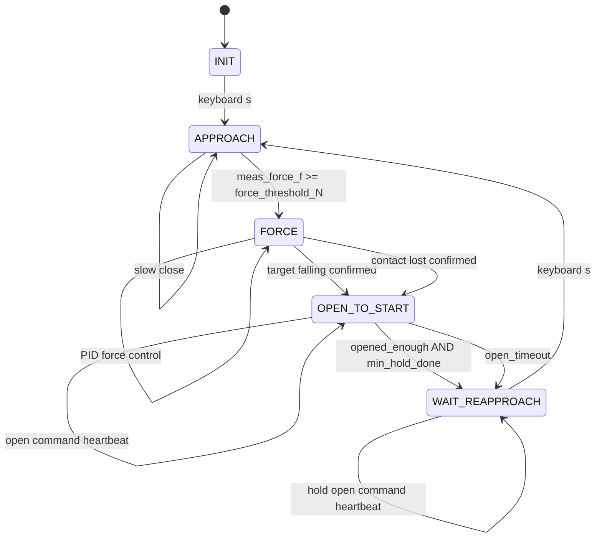

# WSG50 力控状态机改造方案 v3

日期：2026-06-08

本文档是在 `wsg50_fsm_force_ctrl_design_v2.md` 基础上，结合最新评审意见和当前实验目标整理的 v3 方案。

当前实验目标：

```text
1. 自动逻辑只负责释放并张开。
2. 重新 APPROACH 只由人工键盘 s 触发。
3. 已录 CSV 中的“高力区目标力快速下降”就是希望触发张开的释放意图。
4. 第一版先使用 trend_only：目标力快速下降趋势确认后进入 OPEN_TO_START。
5. WAIT_REAPPROACH 中按 s 的行为与 INIT 中按 s 一致：只要按 s 就开始 APPROACH。
6. FORCE 中失接触后进入 OPEN_TO_START，而不是回 APPROACH 或继续闭合。
```

核心状态机：

```text
INIT --s--> APPROACH --contact--> FORCE
FORCE --target falling OR contact lost--> OPEN_TO_START
OPEN_TO_START --opened/timeout--> WAIT_REAPPROACH
WAIT_REAPPROACH --s--> APPROACH
```

---

## 1. 评审意见采纳结论

### 1.1 采纳

| 编号 | 意见 | 处理 |
| --- | --- | --- |
| A1 | `trend_only` 触发前至少要求目标力数据有效，且建议要求实测力也有效 | 采纳。新增 `trend_release_require_meas_valid=True`，第一版趋势释放需要 `target_valid and meas_valid`。 |
| A2 | 趋势检测器不能在 30 Hz FSM tick 中重复喂同一个 target 样本 | 采纳。趋势检测只在收到新目标力样本时更新，`trend_min_samples` 表示真实目标力样本数。 |
| A3 | `trend_min_samples=10` 对 30 Hz 合理，但低频目标力会漏触发 | 采纳为条件化设计。当前 CSV 约 30 Hz，默认仍用 10；如果目标力频率低于 20 Hz，应按频率下调或启用自动样本数。 |
| A4 | FORCE 失接触进入 OPEN_TO_START 需要滞回、grace time 和更长确认时间 | 采纳。新增 `force_contact_lost_threshold_N`、`force_contact_lost_grace_s`、`force_contact_lost_confirm_s`。 |
| A5 | WAIT_REAPPROACH 中目标力低时按 s 不阻止，但应 warning | 采纳。保留“按 s 就 APPROACH”的语义，只增加 warning。 |
| A6 | OPEN_TO_START / WAIT_REAPPROACH 持续发送张开命令时要避免 `_send_goal` 去重抑制 | 采纳。新增强制重发/heartbeat 机制。 |
| A7 | `open_timeout_s=2.0` 可能偏紧 | 采纳。第一版建议改为 `3.0 s`，并按行程和速度公式计算。 |
| A8 | APPROACH 和 FORCE 也要处理 width/status stale | 采纳。APPROACH 没有有效 width 时不继续闭合；FORCE PID 必须要求 target/meas/width 都有效。 |
| A9 | signed raw、abs raw、filtered target 不要混用 | 采纳。明确变量命名，避免 `target_force_raw` 被 abs 值覆盖后误导 debug。 |
| A10 | 进入 OPEN_TO_START 时记录触发指标 | 采纳。新增 `release_trigger_metrics`、`release_trigger_time_s`。 |
| A11 | OPEN_TO_START 中按 s 忽略，但要记录 | 采纳。保留 v2 语义，记录 ignored count 和状态。 |
| A12 | tick 内使用 snapshot，入口函数不要裸读共享变量 | 采纳。入口函数建议接收 `snapshot`。 |
| A13 | sensor stale 策略要明确 | 采纳。第一版采用 `sensor_fault_policy="hold_no_new_cmd"`。 |

### 1.2 部分采纳

| 编号 | 意见 | 处理 |
| --- | --- | --- |
| P1 | `trend_only` 过于激进，应增加释放形状软门槛 | 部分采纳。增加 `trend_shape_guard_mode`，默认 `"warn"`，只警告不阻止；如果误触发多，再切到 `"enforce"`。 |
| P2 | `trend_and_release_shape` 可作为第四种模式 | 部分采纳。保留为可选模式，但第一版仍默认 `release_gate_mode="trend_only"`。 |
| P3 | `trend_use_end_cap` 可以限制末端力 | 部分采纳。参数保留，默认关闭。因为当前希望高力区下降也触发，不能默认要求 `end_level <= 2 N`。 |
| P4 | contact_lost_to_open 第一版先 debug 再启用 | 部分采纳。实施阶段先 debug，最终默认启用。 |

### 1.3 暂不采纳

| 编号 | 意见 | 原因 |
| --- | --- | --- |
| R1 | 恢复 `WAIT_REAPPROACH -> APPROACH` 的目标力门槛 | 不采纳。用户明确要求 WAIT_REAPPROACH 与 INIT 一样，只要按 s 就闭合。 |
| R2 | 第一版改回 `trend_and_low_force` | 不采纳。用户明确说明 CSV 中高力区下降就是想要触发的下降。 |
| R3 | sensor stale 时自动张开 | 暂不采纳。第一版采用 hold/no new command，避免传感器问题导致意外释放。 |

---

## 2. v3 模块划分

| 模块 | 名称 | 作用 |
| --- | --- | --- |
| A | 状态机骨架 | `INIT / APPROACH / FORCE / OPEN_TO_START / WAIT_REAPPROACH` |
| B | 键盘请求 | 键盘线程只置标志，主 tick 消费 |
| C | 目标力趋势检测 | 只在 FORCE 中，且只用新 target 样本更新 |
| D | trend_only 释放触发 | 目标力快速下降确认后进入 OPEN_TO_START |
| E | 释放形状软保护 | 默认只 warning，不阻止；用于防误触发诊断 |
| F | FORCE 失接触转张开 | 失接触确认后进入 OPEN_TO_START |
| G | 张开与保持张开 | OPEN_TO_START / WAIT_REAPPROACH 的 open command heartbeat |
| H | stale 与 sensor fault | target/meas/status 数据有效性检查 |
| I | debug 与指标记录 | 状态、趋势、触发原因、stale、open_failed |
| J | 在线刚度估计 | 后续阶段，只 debug，不直接调 PID |

---

## 3. 状态机

### 3.1 Mermaid 图



### 3.2 ASCII 图

```text
┌───────────┐
│   INIT    │
└─────┬─────┘
      │ s
      ▼
┌────────────┐
│  APPROACH  │
└─────┬──────┘
      │ meas_force_f >= force_threshold_N
      ▼
┌────────────┐
│   FORCE    │
└─────┬──────┘
      │
      ├─ target falling confirmed
      │
      └─ contact lost confirmed
      ▼
┌────────────────┐
│ OPEN_TO_START  │
└───────┬────────┘
        │ opened_enough / timeout
        ▼
┌──────────────────┐
│ WAIT_REAPPROACH  │
└───────┬──────────┘
        │ s
        ▼
   APPROACH
```

### 3.3 状态语义

| 状态 | 行为 | 退出条件 |
| --- | --- | --- |
| `INIT` | 不发闭合命令，等待人工开始 | 按 `s` |
| `APPROACH` | 低速闭合，寻找接触 | `meas_force_f >= force_threshold_N` |
| `FORCE` | PID 力控，同时监测释放趋势和失接触 | 目标力快速下降确认，或失接触确认 |
| `OPEN_TO_START` | 张开到 `start_width_mm` | 到位且保持够久，或超时 |
| `WAIT_REAPPROACH` | 保持张开，等待人工重新开始 | 按 `s` |

---

## 4. 关键行为决策

### 4.1 WAIT_REAPPROACH 中按 s 不设目标力门槛

当前决策：

```text
WAIT_REAPPROACH -> APPROACH
与
INIT -> APPROACH
语义一致。
```

也就是：

```text
只要按 s，就开始 APPROACH。
不要求 target_abs_raw >= 某个门槛。
```

但为了现场排查，保留 warning：

```text
warn_on_low_target_reapproach = True
low_target_reapproach_warn_N = 0.4
```

如果目标力很低时按 `s`：

```text
不阻止闭合；
只打印 warning。
```

### 4.2 FORCE 中失接触直接张开

当前决策：

```text
FORCE 中失接触不回 APPROACH。
FORCE 中失接触不继续 PID 闭合寻找接触。
FORCE 中失接触确认后进入 OPEN_TO_START。
```

理由：

```text
重新接近只能由人工 s 触发。
失接触说明当前抓握/接触过程已经结束或不稳定。
直接张开并等待人工重新开始，状态语义最清楚。
```

### 4.3 第一版使用 trend_only

当前决策：

```text
release_gate_mode = "trend_only"
```

即：

```text
目标力快速下降趋势确认后，直接进入 OPEN_TO_START。
低力条件只 debug，不参与触发。
```

理由：

```text
已录 CSV 中的高力区下降就是想要触发的释放意图。
如果要求 low_force_ok，会把这类下降挡掉。
```

---

## 5. 数据流和变量命名

### 5.1 目标力变量

不要把 signed raw 和 abs raw 混在一起。

建议变量：

| 变量 | 含义 | 用途 |
| --- | --- | --- |
| `target_raw_signed_N` | 从话题解出的原始有符号目标力 | debug，排查符号 |
| `target_abs_raw_N` | `abs(target_raw_signed_N)` | 趋势检测、释放判断 |
| `target_force_f_N` | 对 `target_abs_raw_N` 滤波后的值 | PID 控制目标的基础值 |
| `target_ctrl_N` | `target_scale * target_force_f_N`，再经 deadband | PID error |
| `target_release_N` | 释放/低力观察用目标力，第一版可等于 `target_abs_raw_N` | debug |
| `target_stamp_s` | 目标力消息接收时间 | stale、趋势新样本判断 |

### 5.2 实测力变量

建议变量：

| 变量 | 含义 | 用途 |
| --- | --- | --- |
| `meas_raw_signed_N` | 传感器原始实测力 | debug |
| `meas_scaled_nonneg_N` | `max(0, meas_raw_signed_N * measured_scale)` | 滤波输入 |
| `meas_force_f_N` | EMA 后实测力 | PID error、接触判断 |
| `meas_release_N` | 释放/低力观察用实测力，第一版等于 `meas_force_f_N` | debug |
| `meas_stamp_s` | 实测力消息接收时间 | stale |

### 5.3 宽度变量

| 变量 | 含义 | 用途 |
| --- | --- | --- |
| `width_mm` | WSG status 反馈宽度 | APPROACH 初始化、FORCE PID、OPEN_TO_START 到位判断 |
| `status_stamp_s` | status 接收时间 | stale |
| `cmd_width_mm` | 当前期望命令宽度 | debug |

---

## 6. Snapshot 和线程模型

### 6.1 线程原则

```text
ROS callback 只更新传感器数据。
键盘线程只设置请求标志。
所有状态切换只在主 FSM tick 中执行。
```

### 6.2 锁

建议：

```python
self._lock = threading.RLock()
```

callback 中：

```python
with self._lock:
    self.target_raw_signed_N = raw
    self.target_abs_raw_N = abs(raw)
    self.target_stamp_s = rospy.Time.now().to_sec()
```

tick 开头复制 snapshot：

```python
with self._lock:
    snapshot = SensorSnapshot(
        target_raw_signed_N=self.target_raw_signed_N,
        target_abs_raw_N=self.target_abs_raw_N,
        target_force_f_N=self.target_force_f_N,
        target_stamp_s=self.target_stamp_s,
        meas_raw_signed_N=self.meas_raw_signed_N,
        meas_force_f_N=self.meas_force_f_N,
        meas_stamp_s=self.meas_stamp_s,
        width_mm=self.width_mm,
        status_stamp_s=self.status_stamp_s,
        reapproach_requested=self.reapproach_requested,
    )
```

入口函数建议接收 snapshot：

```python
def enter_approach(self, now_s, snapshot):
    ...
```

不要在入口函数里裸读 `self.width_mm`。

---

## 7. 数据有效性和 stale 策略

### 7.1 stale 参数

| 参数 | 默认值 | 含义 |
| --- | --- | --- |
| `target_stale_timeout_s` | `0.30` | 目标力超过该时间未更新则 stale |
| `meas_stale_timeout_s` | `0.30` | 实测力超过该时间未更新则 stale |
| `status_stale_timeout_s` | `0.50` | 宽度/status 超时 |

### 7.2 valid 标志

```python
target_valid = (
    snapshot.target_abs_raw_N is not None and
    now_s - snapshot.target_stamp_s <= self.target_stale_timeout_s
)

meas_valid = (
    snapshot.meas_force_f_N is not None and
    now_s - snapshot.meas_stamp_s <= self.meas_stale_timeout_s
)

width_valid = (
    snapshot.width_mm is not None and
    now_s - snapshot.status_stamp_s <= self.status_stale_timeout_s
)
```

### 7.3 stale 行为

| 状态 | stale 类型 | 行为 |
| --- | --- | --- |
| `APPROACH` | width stale | 不继续递减 `pos_cmd`，不发布新的闭合命令，throttle warn |
| `APPROACH` | meas stale | 不判断进入 FORCE，throttle warn |
| `FORCE` | target stale | 不更新趋势，不触发 trend release，不运行 PID |
| `FORCE` | meas stale | 不触发 trend release，不判断 contact lost，不运行 PID |
| `FORCE` | width stale | 不运行 PID，因为 `new_width = width - delta` 不可靠 |
| `OPEN_TO_START` | width stale | 不能判定 opened_enough，只能靠 timeout，并记录 `open_failed` |
| `WAIT_REAPPROACH` | target stale | 不影响按 s 进入 APPROACH |

### 7.4 sensor fault policy

第一版明确为：

```text
sensor_fault_policy = "hold_no_new_cmd"
reset_pid_on_stale = True
sensor_fault_open_enable = False
```

含义：

```text
传感器或 status stale 时，不发布新的闭合/PID 命令。
清掉 PID 动态状态，避免恢复后 D 项和积分跳变。
不因为 stale 自动张开。
```

---

## 8. 目标力趋势检测

### 8.1 只在 FORCE 中生效

进入 FORCE 时：

```python
self.target_trend_detector.reset()
self.force_enter_time_s = now_s
self.last_trend_target_stamp_s = None
```

只有 FORCE 状态下才更新趋势检测器。

### 8.2 只用新 target 样本更新

不要在 30 Hz tick 中重复喂同一个 target 消息。

推荐：

```python
new_target_sample = (
    target_valid and
    snapshot.target_stamp_s is not None and
    (
        self.last_trend_target_stamp_s is None or
        snapshot.target_stamp_s > self.last_trend_target_stamp_s
    )
)

if new_target_sample:
    self.last_trend_target_stamp_s = snapshot.target_stamp_s
    falling_confirmed, trend_metrics = self.target_trend_detector.update_and_check(
        snapshot.target_stamp_s,
        snapshot.target_abs_raw_N
    )
else:
    falling_confirmed = False
```

这样：

```text
trend_min_samples=10
表示 10 个目标力话题样本，
不是 10 个 FSM tick。
```

### 8.3 滤波

使用时间常数滤波：

```python
alpha = 1.0 - math.exp(-dt / trend_filter_tau_s)
target_smooth = alpha * target_abs + (1.0 - alpha) * previous
```

参数：

```text
trend_use_time_constant_filter = True
trend_filter_tau_s = 0.08
```

### 8.4 窗口指标

滑动窗口保存：

```python
(target_stamp_s, target_abs_smooth_N)
```

指标：

| 指标 | 计算 | 意义 |
| --- | --- | --- |
| `start_level` | 窗口前 25% 中位数 | 下降起点 |
| `end_level` | 窗口后 25% 中位数 | 下降终点 |
| `drop_N` | `start_level - end_level` | 净下降量 |
| `drop_frac` | `drop_N / start_level` | 相对下降比例 |
| `slope_N_per_s` | 线性拟合斜率 | 下降速度 |
| `neg_mag_ratio` | 下降幅值 / 总有效变化幅值 | 下降是否占主导 |
| `efficiency` | 净下降量 / 总路径长度 | 是否乱跳 |

有效变化定义：

```python
abs(diff) > trend_jitter_deadband_N
```

### 8.5 第一版趋势参数

基于已录 CSV：

```text
采样频率：约 30 Hz
典型高力区下降：0.6 s 内下降约 0.56~0.80 N
典型斜率：约 -1.15~-1.68 N/s
```

推荐：

| 参数 | 默认值 | 依据 |
| --- | --- | --- |
| `trend_window_s` | `0.6` | 覆盖典型下降段 |
| `trend_min_window_s` | `0.35` | 至少约 0.35 s 数据才判断 |
| `trend_min_samples` | `10` | 当前 30 Hz 下约 0.33 s 样本 |
| `trend_jitter_deadband_N` | `0.05` | 过滤小抖动 |
| `trend_min_drop_N` | `0.55` | 低于典型下降段下界 |
| `trend_min_drop_frac` | `0.12` | filtered 信号有效下降多为 0.14~0.20 |
| `trend_min_slope_N_per_s` | `1.0` | 明显下降段多大于 1 N/s |
| `trend_min_neg_mag_ratio` | `0.70` | 下降幅值需占主导 |
| `trend_min_efficiency` | `0.45` | 排除大幅乱跳 |
| `trend_confirm_s` | `0.08` | 约 2~3 个 30 Hz 样本 |
| `trend_cooldown_s` | `0.8` | 防重复触发 |

### 8.6 低频目标力的处理

如果 `/znsv6_cmd/act1` 不是 30 Hz，而是 10 Hz：

```text
0.6 s 只有约 6 个目标力样本。
trend_min_samples=10 会导致永远不触发。
```

因此建议：

```text
如果 target_cmd_hz_est >= 20 Hz：
    trend_min_samples = 10

如果 target_cmd_hz_est < 20 Hz：
    trend_min_samples = 5 或 6
```

可选自动规则：

```python
trend_min_samples_auto = True
trend_min_samples = max(5, int(math.ceil(trend_min_window_s * target_cmd_hz_est)))
```

当前已录 CSV 约 30 Hz，所以第一版文档默认仍用 `10`。

---

## 9. trend_only 释放触发

### 9.1 基本触发

```python
if falling_confirmed:
    self.release_intent_latched = True
    self.release_intent_until_s = now_s + self.release_intent_timeout_s
    self.release_intent_reason = "target_falling"
    self.release_trigger_metrics = trend_metrics
```

trend_only 第一版：

```python
release_intent_ok = (
    self.release_intent_latched and
    now_s <= self.release_intent_until_s
)

if self.release_gate_mode == "trend_only" and trend_release_valid and release_intent_ok:
    self.enter_open_to_start(now_s, reason="target_falling", snapshot=snapshot)
    return
```

### 9.2 释放有效性

为避免 stale 情况下触发：

```text
trend_release_require_meas_valid = True
trend_release_require_status_valid = False
```

伪代码：

```python
trend_release_valid = target_valid

if self.trend_release_require_meas_valid:
    trend_release_valid = trend_release_valid and meas_valid

if self.trend_release_require_status_valid:
    trend_release_valid = trend_release_valid and width_valid
```

第一版要求：

```text
target_valid and meas_valid
```

不强制要求 width valid。

理由：

```text
张开命令即使 width stale 也能发送；
OPEN_TO_START 中用 timeout 和 open_failed 处理 width 不可用。
```

### 9.3 释放形状软保护

`trend_only` 风险：

```text
高力区快速调小目标力可能被误判为释放。
```

但当前用户明确希望高力区快速下降触发张开，所以第一版不强制阻止。

新增诊断参数：

```text
trend_shape_guard_mode = "warn"   # off / warn / enforce
trend_use_end_cap = False
trend_max_end_N = 2.0
trend_use_min_drop_frac_high_force = False
trend_high_force_start_N = 3.0
trend_min_drop_frac_high_force = 0.18
```

含义：

| 参数 | 默认 | 说明 |
| --- | --- | --- |
| `trend_shape_guard_mode` | `"warn"` | 只报警，不阻止触发 |
| `trend_use_end_cap` | `False` | 是否要求下降末端低于某个力 |
| `trend_max_end_N` | `2.0` | 末端目标力上限 |
| `trend_use_min_drop_frac_high_force` | `False` | 是否对高力起点要求更大相对下降 |
| `trend_high_force_start_N` | `3.0` | 高力区起点判定 |
| `trend_min_drop_frac_high_force` | `0.18` | 高力区更严格下降比例 |

如果以后发现误触发，可以改：

```text
trend_shape_guard_mode = "enforce"
trend_use_min_drop_frac_high_force = True
```

或者切换：

```text
release_gate_mode = "trend_and_release_shape"
```

---

## 10. 低力释放观察

第一版低力只做 debug。

```text
low_force_ok 不参与 trend_only 触发。
```

仍保留：

| 参数 | 默认值 | 用途 |
| --- | --- | --- |
| `release_target_threshold_N` | `0.4` | 目标力低力观察 |
| `release_measured_threshold_N` | `0.8` | 实测力低力观察 |
| `release_target_low_confirm_s` | `0.08` | 目标低力确认 |
| `release_measured_low_confirm_s` | `0.12` | 实测低力确认 |

作用：

```text
1. debug 中看目标力/实测力是否进入低力区。
2. 如果 trend_only 误触发多，可以切换到 trend_and_target_low 或 trend_and_low_force。
```

---

## 11. FORCE 中 contact_lost -> OPEN_TO_START

### 11.1 为什么需要滞回

如果进入 FORCE 和失接触使用同一个阈值：

```python
enter_force: meas_force_f >= force_threshold_N
contact_lost: meas_force_f < force_threshold_N
```

在阈值附近容易抖动。

### 11.2 参数

| 参数 | 默认值 | 说明 |
| --- | --- | --- |
| `force_contact_lost_to_open_enable` | `True` | 失接触后进入 OPEN_TO_START |
| `force_contact_lost_threshold_N` | `0.05` | 失接触阈值，默认是 `0.5 * force_threshold_N` |
| `force_contact_lost_grace_s` | `0.25` | 刚进入 FORCE 后多久不判失接触 |
| `force_contact_lost_confirm_s` | `0.30` | 低于失接触阈值持续多久才确认 |

如果 `force_threshold_N = 0.1`：

```text
force_contact_lost_threshold_N = 0.05
```

### 11.3 伪代码

```python
if self.force_contact_lost_to_open_enable and meas_valid:
    in_grace = now_s - self.force_enter_time_s < self.force_contact_lost_grace_s

    if not in_grace:
        contact_lost_now = (
            snapshot.meas_force_f_N < self.force_contact_lost_threshold_N
        )

        contact_lost_confirmed = self.contact_lost_timer.update(
            contact_lost_now,
            now_s,
            self.force_contact_lost_confirm_s
        )

        if contact_lost_confirmed:
            self.enter_open_to_start(now_s, reason="contact_lost", snapshot=snapshot)
            return
```

### 11.4 实施建议

虽然最终默认可启用，但机器人上建议分阶段：

```text
先 debug contact_lost_now/contact_lost_confirmed；
确认不会在 FORCE 边界抖动时误触发；
再启用 contact_lost_to_open。
```

---

## 12. FORCE PID 有效性

FORCE PID 必须要求：

```python
force_pid_valid = target_valid and meas_valid and width_valid
```

如果无效：

```python
if not force_pid_valid:
    self._reset_pid_dynamic_state()
    rospy.logwarn_throttle(1.0, "Skip FORCE PID: stale target/meas/status")
    return
```

重置动态状态：

```python
def _reset_pid_dynamic_state(self):
    self.int_acc = 0.0
    self.prev_err = None
    self.prev_pid_time_s = None
```

理由：

```text
width stale 时 new_width = width - delta 不可靠。
target/meas stale 时 error 不可靠。
stale 恢复后不应让 D 项或积分项突然跳变。
```

---

## 13. APPROACH 有效性

APPROACH 中也需要 status/meas 有效。

建议：

```python
approach_valid = width_valid and meas_valid
```

如果 `width_valid=False`：

```text
不继续 pos_cmd -= step。
不发布新的闭合命令。
throttle warn。
```

如果 `meas_valid=False`：

```text
可以不判断进入 FORCE。
建议不继续闭合，避免无实测力保护时持续闭合。
```

第一版更保守：

```python
if not (width_valid and meas_valid):
    rospy.logwarn_throttle(1.0, "Skip APPROACH: stale width or measured force")
    return
```

---

## 14. OPEN_TO_START 和 WAIT_REAPPROACH

### 14.1 OPEN_TO_START 行为

进入时：

```python
self.open_reason = reason
self.open_enter_time_s = now_s
self.open_failed = False
self.opened_enough = False
self.release_trigger_time_s = now_s
self.release_trigger_metrics = trend_metrics
self._reset_send_cache()
```

状态中：

```python
self._send_goal(
    self.start_width_mm,
    self.open_speed_mm_s,
    force=force_resend
)
```

到位：

```python
opened_enough = (
    width_valid and
    snapshot.width_mm >= self.start_width_mm - self.open_width_tol_mm
)
```

退出：

```python
if (opened_enough and min_hold_done) or timeout:
    self.opened_enough = opened_enough
    self.open_failed = timeout and not opened_enough
    self.enter_wait_reapproach(now_s, snapshot)
```

### 14.2 open timeout

建议默认：

```text
open_timeout_s = 3.0
```

依据：

```text
如果从 10 mm 张开到 110 mm，open_speed=50 mm/s，
理论时间就是 2.0 s。
实际还要考虑通信、驱动响应、反馈延迟。
```

公式：

```text
open_timeout_s >= (start_width_mm - min_expected_grasp_width_mm) / open_speed_mm_s + 0.5
```

### 14.3 命令 heartbeat

当前 `_send_goal` 有去重逻辑：

```text
同一个目标位置重复发送可能被 pos_eps 抑制。
```

所以新增：

```python
def _send_goal(self, width_mm, speed_mm_s, force=False):
    if force:
        publish
        update_cache
        return
```

参数：

```text
open_command_force_resend_period_s = 0.30
hold_open_command_period_s = 0.30
```

强制发送场景：

```text
1. enter_open_to_start 后第一条 open 命令
2. OPEN_TO_START 中每 open_command_force_resend_period_s
3. enter_wait_reapproach 后第一条 hold-open 命令
4. WAIT_REAPPROACH 中每 hold_open_command_period_s
5. open_failed=True 时保持 heartbeat
```

### 14.4 WAIT_REAPPROACH 中按 s

```python
elif self.state == "WAIT_REAPPROACH":
    self._send_goal(
        self.start_width_mm,
        self.hold_open_speed_mm_s,
        force=hold_open_force_resend
    )

    if self.reapproach_requested:
        self.reapproach_requested = False

        if self.warn_on_low_target_reapproach and target_valid:
            if snapshot.target_abs_raw_N < self.low_target_reapproach_warn_N:
                rospy.logwarn(
                    "Re-approach accepted, but target force is low: %.3f N",
                    snapshot.target_abs_raw_N
                )

        self.enter_approach(now_s, snapshot)
        return
```

注意：

```text
warning 不阻止进入 APPROACH。
```

---

## 15. 键盘输入

键盘线程：

```python
if key == "s":
    with self._lock:
        self.reapproach_requested = True
        self.last_s_time_s = rospy.Time.now().to_sec()
```

主 tick 消费：

```python
if self.reapproach_requested:
    if self.state in ("INIT", "WAIT_REAPPROACH"):
        self.reapproach_requested = False
        self.enter_approach(now_s, snapshot)
    else:
        self.reapproach_requested = False
        self.ignored_s_count += 1
        self.last_ignored_s_state = self.state
```

`OPEN_TO_START` 中按 `s`：

```text
第一版忽略。
记录 ignored_s_count 和 last_ignored_s_state=OPEN_TO_START。
```

---

## 16. 状态入口函数

### 16.1 enter_approach

```python
def enter_approach(self, now_s, snapshot):
    self.state = "APPROACH"

    if snapshot.width_valid:
        self.pos_cmd = clamp(snapshot.width_mm, self.min_width_mm, self.max_width_mm)
    else:
        self.pos_cmd = clamp(self.start_width_mm, self.min_width_mm, self.max_width_mm)

    self._reset_pid_dynamic_state()
    self.target_trend_detector.reset()
    self.contact_lost_timer.reset()
    self._reset_send_cache()
```

### 16.2 enter_force

```python
def enter_force(self, now_s, snapshot):
    self.state = "FORCE"
    self.force_enter_time_s = now_s

    self._reset_pid_dynamic_state()
    self.target_trend_detector.reset()
    self.contact_lost_timer.reset()

    self.last_trend_target_stamp_s = None
    self.release_intent_latched = False
    self.release_intent_until_s = 0.0

    self._t_force_start = rospy.Time.now()
    self._force_log = []
```

### 16.3 enter_open_to_start

```python
def enter_open_to_start(self, now_s, reason, snapshot, trend_metrics=None):
    self.state = "OPEN_TO_START"
    self.open_reason = reason
    self.open_enter_time_s = now_s
    self.open_failed = False
    self.opened_enough = False

    self.release_trigger_time_s = now_s
    self.release_trigger_metrics = copy.deepcopy(trend_metrics)

    self._reset_pid_dynamic_state()
    self._reset_send_cache()
```

### 16.4 enter_wait_reapproach

```python
def enter_wait_reapproach(self, now_s, snapshot):
    self.state = "WAIT_REAPPROACH"
    self.wait_reapproach_enter_time_s = now_s

    self.reapproach_requested = False
    self.release_intent_latched = False
    self.release_intent_until_s = 0.0

    self.target_trend_detector.reset()
    self.contact_lost_timer.reset()
    self._reset_send_cache()
```

---

## 17. Debug 输出

建议 debug 字段：

### 17.1 状态字段

```text
state
prev_state
open_reason
open_elapsed_s
opened_enough
open_failed
release_trigger_time_s
release_trigger_metrics
```

### 17.2 键盘字段

```text
reapproach_requested
ignored_s_count
last_s_time_s
last_ignored_s_state
warn_on_low_target_reapproach
```

### 17.3 数据字段

```text
target_raw_signed_N
target_abs_raw_N
target_force_f_N
target_release_N
target_age_s
target_stale

meas_raw_signed_N
meas_scaled_nonneg_N
meas_force_f_N
meas_release_N
meas_age_s
meas_stale

width_mm
width_age_s
width_stale
```

### 17.4 趋势字段

```text
new_target_sample
trend_n_samples
trend_window_duration_s
trend_start_level_N
trend_end_level_N
trend_drop_N
trend_drop_frac
trend_slope_N_per_s
trend_neg_mag_ratio
trend_efficiency
trend_falling
trend_confirmed
release_intent_latched
release_intent_ok
release_open_triggered
trend_shape_guard_mode
trend_shape_warning
```

### 17.5 低力观察字段

```text
target_low_now
target_low_confirmed
measured_low_now
measured_low_confirmed
low_force_ok
```

### 17.6 contact lost 字段

```text
contact_lost_now
contact_lost_confirmed
contact_lost_in_grace
force_contact_lost_threshold_N
contact_lost_open_triggered
```

### 17.7 stale / fault 字段

```text
sensor_fault_policy
force_pid_valid
approach_valid
reset_pid_on_stale
```

---

## 18. 参数总表

### 18.1 状态机和张开

| 参数 | 推荐默认值 | 说明 |
| --- | --- | --- |
| `manual_reapproach_only` | `True` | 张开后只由键盘重新 APPROACH |
| `open_speed_mm_s` | `50.0` | 张开速度 |
| `hold_open_speed_mm_s` | `30.0` | WAIT_REAPPROACH 保持张开速度 |
| `open_width_tol_mm` | `2.0` | 到位容差 |
| `open_min_hold_s` | `0.25` | 到位后最小保持 |
| `open_timeout_s` | `3.0` | 张开超时 |
| `open_command_force_resend_period_s` | `0.30` | OPEN_TO_START 强制重发周期 |
| `hold_open_command_period_s` | `0.30` | WAIT_REAPPROACH 强制重发周期 |

### 18.2 键盘和 warning

| 参数 | 推荐默认值 | 说明 |
| --- | --- | --- |
| `warn_on_low_target_reapproach` | `True` | 目标力低时按 s 只警告 |
| `low_target_reapproach_warn_N` | `0.4` | warning 阈值 |

### 18.3 stale / fault

| 参数 | 推荐默认值 | 说明 |
| --- | --- | --- |
| `target_stale_timeout_s` | `0.30` | 目标力超时 |
| `meas_stale_timeout_s` | `0.30` | 实测力超时 |
| `status_stale_timeout_s` | `0.50` | status 超时 |
| `sensor_fault_policy` | `"hold_no_new_cmd"` | stale 时不发新命令 |
| `reset_pid_on_stale` | `True` | stale 时清 PID 动态状态 |
| `sensor_fault_open_enable` | `False` | stale 不自动张开 |

### 18.4 趋势释放

| 参数 | 推荐默认值 | 说明 |
| --- | --- | --- |
| `release_gate_mode` | `"trend_only"` | 第一版目标力快速下降直接张开 |
| `release_intent_timeout_s` | `1.5` | 释放意图超时 |
| `trend_release_require_meas_valid` | `True` | 趋势释放要求实测力有效 |
| `trend_release_require_status_valid` | `False` | 趋势释放不强制 width 有效 |

### 18.5 趋势检测

| 参数 | 推荐默认值 | 说明 |
| --- | --- | --- |
| `trend_open_enable` | `True` | 启用趋势检测 |
| `trend_window_s` | `0.6` | 趋势窗口 |
| `trend_min_window_s` | `0.35` | 最小窗口时间 |
| `trend_min_samples` | `10` | 当前 30 Hz 数据下使用 |
| `trend_min_samples_auto` | `False` | 低频目标力时可启用 |
| `target_cmd_hz_est` | `30.0` | 目标力估计频率 |
| `trend_use_time_constant_filter` | `True` | 时间常数滤波 |
| `trend_filter_tau_s` | `0.08` | 滤波时间常数 |
| `trend_jitter_deadband_N` | `0.05` | 抖动死区 |
| `trend_min_start_N` | `0.8` | 起点太低不触发 |
| `trend_min_drop_N` | `0.55` | 最小净下降 |
| `trend_min_drop_frac` | `0.12` | 最小相对下降 |
| `trend_min_slope_N_per_s` | `1.0` | 最小下降斜率 |
| `trend_min_neg_mag_ratio` | `0.70` | 下降幅值占比 |
| `trend_min_efficiency` | `0.45` | 下降效率 |
| `trend_confirm_s` | `0.08` | 趋势确认时间 |
| `trend_cooldown_s` | `0.8` | 冷却时间 |

### 18.6 释放形状软保护

| 参数 | 推荐默认值 | 说明 |
| --- | --- | --- |
| `trend_shape_guard_mode` | `"warn"` | off/warn/enforce |
| `trend_use_end_cap` | `False` | 是否限制下降末端力 |
| `trend_max_end_N` | `2.0` | 下降末端上限 |
| `trend_use_min_drop_frac_high_force` | `False` | 高力区是否要求更大相对下降 |
| `trend_high_force_start_N` | `3.0` | 高力区起点 |
| `trend_min_drop_frac_high_force` | `0.18` | 高力区额外相对下降要求 |

### 18.7 低力观察

| 参数 | 推荐默认值 | 说明 |
| --- | --- | --- |
| `release_target_threshold_N` | `0.4` | 只 debug |
| `release_measured_threshold_N` | `0.8` | 只 debug |
| `release_target_low_confirm_s` | `0.08` | 只 debug |
| `release_measured_low_confirm_s` | `0.12` | 只 debug |

### 18.8 contact lost

| 参数 | 推荐默认值 | 说明 |
| --- | --- | --- |
| `force_contact_lost_to_open_enable` | `True` | 失接触后张开 |
| `force_contact_lost_threshold_N` | `0.05` | 默认 0.5 * force_threshold |
| `force_contact_lost_grace_s` | `0.25` | 进入 FORCE 后宽限时间 |
| `force_contact_lost_confirm_s` | `0.30` | 失接触确认时间 |

### 18.9 刚度估计

| 参数 | 推荐默认值 | 说明 |
| --- | --- | --- |
| `stiffness_enable` | `False` | 第一版关闭 |
| `pid_schedule_enable` | `False` | 第一版关闭 |
| `stiffness_debug_only` | `True` | 后续只 debug |

---

## 19. FORCE 主逻辑伪代码

```python
elif self.state == "FORCE":
    now_s = rospy.Time.now().to_sec()
    snapshot = self._make_snapshot(now_s)

    target_valid = snapshot.target_valid
    meas_valid = snapshot.meas_valid
    width_valid = snapshot.width_valid

    # 1. 目标力趋势：只在新 target 样本到达时更新
    falling_confirmed = False
    trend_metrics = None

    if target_valid and self.trend_open_enable:
        new_target_sample = (
            self.last_trend_target_stamp_s is None or
            snapshot.target_stamp_s > self.last_trend_target_stamp_s
        )

        if new_target_sample:
            self.last_trend_target_stamp_s = snapshot.target_stamp_s
            falling_confirmed, trend_metrics = self.target_trend_detector.update_and_check(
                snapshot.target_stamp_s,
                snapshot.target_abs_raw_N
            )

            if falling_confirmed:
                self.release_intent_latched = True
                self.release_intent_until_s = now_s + self.release_intent_timeout_s
                self.release_intent_reason = "target_falling"
                self.release_trigger_metrics = trend_metrics

    release_intent_ok = (
        self.release_intent_latched and
        now_s <= self.release_intent_until_s
    )

    # 2. 低力观察只更新 debug
    self._update_low_force_debug(now_s, snapshot)

    # 3. trend_only 释放
    trend_release_valid = target_valid
    if self.trend_release_require_meas_valid:
        trend_release_valid = trend_release_valid and meas_valid
    if self.trend_release_require_status_valid:
        trend_release_valid = trend_release_valid and width_valid

    if (
        self.release_gate_mode == "trend_only" and
        trend_release_valid and
        release_intent_ok
    ):
        self.enter_open_to_start(
            now_s,
            reason="target_falling",
            snapshot=snapshot,
            trend_metrics=self.release_trigger_metrics
        )
        return

    # 4. FORCE 失接触转张开
    if self.force_contact_lost_to_open_enable and meas_valid:
        in_grace = now_s - self.force_enter_time_s < self.force_contact_lost_grace_s

        if not in_grace:
            contact_lost_now = (
                snapshot.meas_force_f_N < self.force_contact_lost_threshold_N
            )
            contact_lost_confirmed = self.contact_lost_timer.update(
                contact_lost_now,
                now_s,
                self.force_contact_lost_confirm_s
            )

            if contact_lost_confirmed:
                self.enter_open_to_start(
                    now_s,
                    reason="contact_lost",
                    snapshot=snapshot
                )
                return

    # 5. PID 需要 target/meas/width 全有效
    if not (target_valid and meas_valid and width_valid):
        self._reset_pid_dynamic_state()
        rospy.logwarn_throttle(1.0, "Skip FORCE PID: stale target/meas/status")
        return

    self._run_force_pid(now_s, snapshot)
```

---

## 20. 实施顺序

| 阶段 | 内容 | 是否上机器人启用 |
| --- | --- | --- |
| 1 | 状态机骨架：新增 `WAIT_REAPPROACH`，键盘请求主 tick 消费 | 可以 |
| 2 | snapshot、stale、sensor fault policy、debug 字段 | 可以 |
| 3 | 趋势检测只 debug，不触发张开 | 可以 |
| 4 | 启用 `trend_only` 触发 `OPEN_TO_START` | 小心测试 |
| 5 | contact_lost 只 debug | 可以 |
| 6 | 启用 `contact_lost -> OPEN_TO_START` | 小心测试 |
| 7 | open command heartbeat / force resend | 应尽早实现 |
| 8 | 刚度估计 debug | 后续 |
| 9 | PID 调度 | 最后 |

---

## 21. 必测场景

| 场景 | 期望行为 |
| --- | --- |
| 稳定抓握，目标力小幅抖动 | 不进入 `OPEN_TO_START` |
| 已录 CSV 中的高力区快速下降 | 进入 `OPEN_TO_START(reason="target_falling")` |
| 目标力从 `6 N -> 5.2 N` 快速下降但实际不想释放 | 用于评估是否需要启用 shape guard |
| 目标力慢速调小 | 不触发趋势释放 |
| 目标力 topic 10 Hz，FSM 30 Hz | 不重复喂样本；`trend_min_samples` 不应虚假满足 |
| 刚进入 FORCE 后力在阈值附近抖动 | 不应立刻 contact_lost |
| FORCE 中实测力持续低于 lost threshold | 进入 `OPEN_TO_START(reason="contact_lost")` |
| WAIT_REAPPROACH 中目标力为 0 时按 s | 进入 APPROACH，但打印 low target warning |
| OPEN_TO_START 中按 s | 忽略，记录 `ignored_s_count` |
| width/status stale 时 APPROACH | 不继续闭合，warn |
| width/status stale 时 FORCE | 不运行 PID，清 PID 动态状态 |
| OPEN_TO_START 超时但未张开到位 | 进入 WAIT，`open_failed=True` |
| WAIT_REAPPROACH 中 open_failed=True | 继续 heartbeat 重发 open command |
| sensor stale 后恢复 | PID 不应因旧 `prev_err/prev_pid_time_s` 跳变 |

---

## 22. 需要继续实测的参数

```text
1. /znsv6_cmd/act1 实际频率：___ Hz
2. /znsv6_data_sensor1 实际频率：___ Hz
3. /wsg_50_driver/status 实际频率：___ Hz
4. 高力区快速下降中，哪些是“释放”，哪些只是“调小”：记录样例
5. 刚进入 FORCE 后，meas_force_f 在阈值附近抖动持续多久：___ s
6. 真正失接触时，meas_force_f 会降到多少：___ N
7. 张开从最小典型抓握宽度到 110 mm 的实际时间：___ s
8. status/width 是否会停更或延迟：是/否
```

---

## 23. 第一版推荐默认参数

```text
manual_reapproach_only = True

open_speed_mm_s = 50.0
hold_open_speed_mm_s = 30.0
open_width_tol_mm = 2.0
open_min_hold_s = 0.25
open_timeout_s = 3.0
open_command_force_resend_period_s = 0.30
hold_open_command_period_s = 0.30

warn_on_low_target_reapproach = True
low_target_reapproach_warn_N = 0.4

target_stale_timeout_s = 0.30
meas_stale_timeout_s = 0.30
status_stale_timeout_s = 0.50
sensor_fault_policy = "hold_no_new_cmd"
reset_pid_on_stale = True
sensor_fault_open_enable = False

release_gate_mode = "trend_only"
release_intent_timeout_s = 1.5
trend_release_require_meas_valid = True
trend_release_require_status_valid = False

trend_open_enable = True
trend_window_s = 0.6
trend_min_window_s = 0.35
trend_min_samples = 10
trend_min_samples_auto = False
target_cmd_hz_est = 30.0
trend_use_time_constant_filter = True
trend_filter_tau_s = 0.08
trend_jitter_deadband_N = 0.05
trend_min_start_N = 0.8
trend_min_drop_N = 0.55
trend_min_drop_frac = 0.12
trend_min_slope_N_per_s = 1.0
trend_min_neg_mag_ratio = 0.70
trend_min_efficiency = 0.45
trend_confirm_s = 0.08
trend_cooldown_s = 0.8

trend_shape_guard_mode = "warn"
trend_use_end_cap = False
trend_max_end_N = 2.0
trend_use_min_drop_frac_high_force = False
trend_high_force_start_N = 3.0
trend_min_drop_frac_high_force = 0.18

release_target_threshold_N = 0.4
release_measured_threshold_N = 0.8
release_target_low_confirm_s = 0.08
release_measured_low_confirm_s = 0.12

force_contact_lost_to_open_enable = True
force_contact_lost_threshold_N = 0.05
force_contact_lost_grace_s = 0.25
force_contact_lost_confirm_s = 0.30

stiffness_enable = False
pid_schedule_enable = False
stiffness_debug_only = True
```

---

## 24. 最终方案摘要

v3 的最终行为：

```text
1. INIT 中按 s -> APPROACH。
2. APPROACH 中低速闭合，实测力达到接触阈值 -> FORCE。
3. FORCE 中只在新 target 样本到来时更新趋势检测。
4. 目标力快速下降趋势确认，并且 target/meas 数据有效 -> OPEN_TO_START。
5. FORCE 中实测力低于 lost threshold，经过 grace 和 confirm -> OPEN_TO_START。
6. OPEN_TO_START 持续张开，带 heartbeat；到位或超时 -> WAIT_REAPPROACH。
7. WAIT_REAPPROACH 持续保持张开，带 heartbeat。
8. WAIT_REAPPROACH 中按 s -> APPROACH，不检查目标力门槛，但目标力很低时 warning。
```

v3 相比 v2 的关键增强：

```text
1. trend_only 仍保留，但增加 trend_release_valid，要求 target/meas 有效。
2. 趋势检测只吃新 target 样本，避免 30 Hz tick 重复喂数据。
3. contact_lost 增加 lost threshold、grace time、confirm time。
4. APPROACH/FORCE 都明确处理 width/status stale。
5. OPEN_TO_START/WAIT_REAPPROACH 增加 heartbeat，避免 _send_goal 去重导致不重发。
6. target/meas 变量命名拆清楚，避免 signed raw 和 abs raw 混用。
7. 形状保护默认 warning，不阻止当前想要的高力区释放触发。
```

整体结论：

```text
v3 可以作为实现前的完整方案。
建议先实现状态机骨架、snapshot/stale/debug、open heartbeat；
再打开趋势检测 debug；
确认趋势指标稳定后启用 trend_only；
最后再启用 contact_lost_to_open 和刚度 debug。
```
