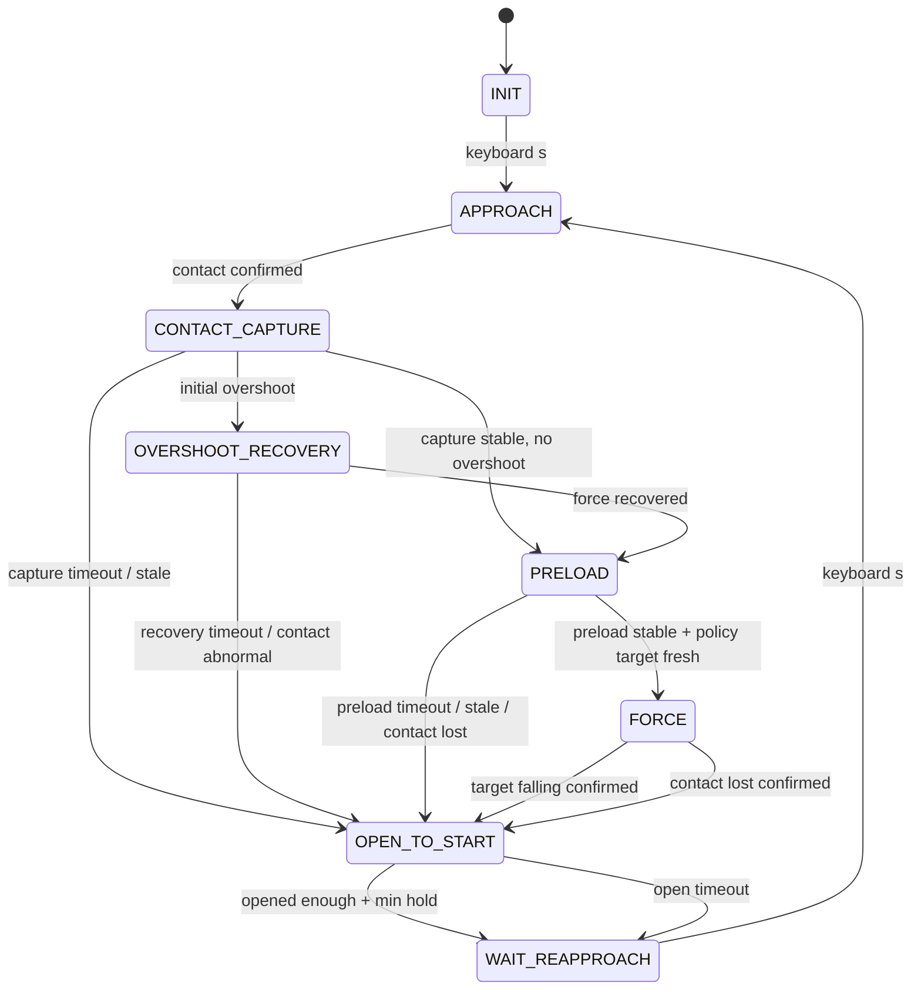

# WSG50 力控状态机改造方案 v4：接触捕获、预加载与网络接管保护

日期：2026-06-10

本文档是在 `wsg50_fsm_force_ctrl_design_v3.md` 基础上，针对当前实验中出现的“刚接触后法向力过大、网络目标力进入分布外状态”的问题整理的 v4 方案。

当前实际脚本 `wsg50_fsm_force_ctrl.py` 已包含可选 v4 接触捕获/预加载管线。
本文以实际脚本中的参数名和默认值为准，避免和代码或其他设计文档冲突。

---

## 1. 当前问题判断

当前 v3 状态机核心链路是：

```text
INIT --s--> APPROACH --meas_force_f >= force_threshold_N--> FORCE
FORCE --target falling / contact lost--> OPEN_TO_START
OPEN_TO_START --opened/timeout--> WAIT_REAPPROACH
WAIT_REAPPROACH --s--> APPROACH
```

这个结构能完成释放和人工重新接近，但它有一个新的问题：

```text
APPROACH 一旦检测到接触，就立刻进入 FORCE。
FORCE 立刻使用网络目标力做 PID 力控。
```

如果接触检测、力滤波、夹爪命令链路或网络推理存在延迟，可能出现：

```text
刚进入 FORCE 时，法向力已经偏大；
但切向力/载荷信息很弱；
这个状态在训练数据中很少出现。
```

这不是简单的“网络目标力不准”，而是：

```text
接触建立阶段的物理状态超出了训练分布。
```

因此，v4 的核心思路是：

```text
不要让网络直接处理刚接触的异常瞬态。
先用确定性状态机把接触状态拉回一个轻微、稳定、接近训练分布的预加载状态；
再让网络目标力平滑接管。
```

---

## 2. 对原建议的采纳结论

### 2.1 采纳

| 编号 | 建议 | 是否采纳 | 原因 |
| --- | --- | --- | --- |
| A1 | 在 `APPROACH` 和 `FORCE` 之间增加 `CONTACT_CAPTURE` | 采纳 | 当前最大风险就是接触瞬间过冲，必须先停止继续闭合。 |
| A2 | 增加 `PRELOAD`，先建立固定小目标力，再进入网络力控 | 采纳 | 能把网络输入带回更接近训练分布的轻接触状态。 |
| A3 | 进入 `FORCE` 后网络目标力渐变接管 | 采纳 | 避免网络目标力或滤波目标力第一拍突变。 |
| A4 | 过冲时进入恢复状态，而不是直接让网络处理 | 采纳 | 高法向、低切向属于控制异常，应由确定性逻辑兜底。 |
| A5 | 网络推理提前运行，但只缓存，不提前执行 | 采纳 | 当前 FSM 已经持续订阅目标力，后续要确保策略端也在 FORCE 前持续发布。 |
| A6 | 失败恢复复用 `OPEN_TO_START -> WAIT_REAPPROACH` | 采纳 | 和 v3 “重新接近只由人工 s 触发”的语义一致。 |
| A7 | 加更多 debug 字段 | 采纳 | 接触捕获阶段必须靠曲线和状态字段调参。 |

### 2.2 部分采纳

| 编号 | 建议 | 处理 |
| --- | --- | --- |
| P1 | `OVERSHOOT_RECOVERY` 使用法向力 + 切向力判断 | 部分采纳。当前控制文件只有单路实测力输入，第一版先用单轴法向力近似判断；切向力/shear ratio 作为可选扩展。 |
| P2 | normal-shear plausibility shield | 部分采纳。短期只有单轴力时无法完整实现；可以先做“初始接触法向力上限 shield”，有切向力后再升级。 |
| P3 | `APPROACH` 分 FAST/SLOW 两段 | 部分采纳。可以做，但要先处理传感器零漂；否则空载 0.11 N 会让 slow threshold 很难设。 |
| P4 | 过冲恢复中按力误差连续微张开 | 部分采纳。第一版采用简单、可控的微张开步进；确认稳定后再上比例开环/闭环。 |

### 2.3 暂不采纳

| 编号 | 建议 | 原因 |
| --- | --- | --- |
| R1 | 第一版完整使用切向力、shear ratio、normal-shear 上限模型 | 当前工程里没有明确接入切向力 topic，直接设计会不可验证。 |
| R2 | 把接触建立/恢复交给网络或 MoE expert | 这应该是后续数据补充后的方向，不适合作为第一道工程保护。 |
| R3 | 只靠降低 approach speed 或 PID 增益解决 | 只能缓解，不能解决 OOD 接触瞬态。 |

---

## 3. v4 推荐状态机

### 3.1 状态集合

v4 推荐状态：

```text
INIT
APPROACH
CONTACT_CAPTURE
OVERSHOOT_RECOVERY
PRELOAD
FORCE
OPEN_TO_START
WAIT_REAPPROACH
```

相对 v3，新增三个状态：

```text
CONTACT_CAPTURE
OVERSHOOT_RECOVERY
PRELOAD
```

### 3.2 Mermaid 状态图



### 3.3 ASCII 状态图

```text
┌───────────┐
│   INIT    │
└─────┬─────┘
      │ s
      ▼
┌────────────┐
│  APPROACH  │
└─────┬──────┘
      │ contact confirmed
      ▼
┌─────────────────┐
│ CONTACT_CAPTURE │
└─────┬─────┬─────┘
      │     │
      │     └── no overshoot / stable ──┐
      │                                 ▼
      │                         ┌────────────┐
      │                         │  PRELOAD   │
      │                         └─────┬──────┘
      │                               │ preload stable + policy fresh
      ▼                               ▼
┌────────────────────┐          ┌────────────┐
│ OVERSHOOT_RECOVERY │          │   FORCE    │
└─────┬──────────────┘          └─────┬──────┘
      │ recovered                     │ release / contact lost
      └──────────────► PRELOAD        ▼
                               ┌────────────────┐
                               │ OPEN_TO_START  │
                               └───────┬────────┘
                                       │ opened / timeout
                                       ▼
                               ┌──────────────────┐
                               │ WAIT_REAPPROACH  │
                               └──────────────────┘
```

---

## 4. 各状态详细设计

### 4.1 `APPROACH`

目标：

```text
低速闭合，寻找接触。
不使用网络目标力控制夹爪。
```

v3 当前逻辑：

```python
if meas_force_f_N >= force_threshold_N:
    enter_force()
```

v4 改为：

```python
if contact_confirmed:
    enter_contact_capture()
```

推荐接触判断不要只用一帧：

```text
meas_force_contact_N >= force_threshold_N
并持续 force_enter_confirm_s
```

这里建议引入一个经过零点补偿后的接触判断量：

```python
meas_force_contact_N = max(0.0, meas_force_f_N - force_baseline_N)
```

原因是你已经观察到空载实测力可能在 `0.10 ~ 0.11 N`，如果不做 baseline，`force_threshold_N=0.10` 会立刻误触发。

第一版可以先不做完整 baseline 自动校准，但接触阈值必须设高于空载噪声上界。

### 4.2 `CONTACT_CAPTURE`

目标：

```text
刚接触后立刻停止继续闭合，消除 APPROACH 阶段的命令延迟和机械过冲。
短时间等待力信号和宽度反馈稳定。
```

进入动作：

```python
capture_start_width_mm = current_width_mm
capture_start_force_N = meas_force_contact_N
pos_cmd = current_width_mm
reset_pid()
reset_send_cache()
```

状态行为有两种模式：

| 模式 | 行为 | 推荐 |
| --- | --- | --- |
| hold | 发送当前宽度，停止继续闭合 | 安全，第一版可用 |
| backoff | 发送当前宽度 + 小量张开 | 更能抑制过冲，推荐第一版启用小 backoff |

推荐第一版：

```text
capture_backoff_enable = True
capture_backoff_mm = 0.15 ~ 0.25 mm
```

退出条件：

```text
等待 capture_settle_s 后：
    如果过冲 -> OVERSHOOT_RECOVERY
    否则 -> PRELOAD
```

如果数据 stale 或状态异常：

```text
CONTACT_CAPTURE -> OPEN_TO_START(reason="capture_fault")
```

### 4.3 `OVERSHOOT_RECOVERY`

目标：

```text
接触刚建立时，如果法向力已经明显过大，不进入网络力控。
先微张开减力，把接触拉回预加载区间。
```

当前工程第一版没有切向力输入，因此过冲判断先用单轴法向力：

```python
initial_overshoot = (
    contact_age_s <= capture_overshoot_check_s and
    meas_force_contact_N >= capture_normal_high_N
)
```

如果后续有切向力，升级为：

```python
normal_high = normal_force_N >= capture_normal_high_N
tangent_low = abs(tangent_force_N) <= capture_tangent_low_N
shear_ratio_low = abs(tangent_force_N) / max(normal_force_N, 1e-6) <= capture_shear_ratio_low

initial_overshoot = (
    contact_age_s <= capture_overshoot_check_s and
    normal_high and
    (tangent_low or shear_ratio_low)
)
```

恢复动作：

```text
每个 tick 按小步长张开，直到力回到 preload_high_N 以下。
```

第一版建议动作：

```python
open_step_mm = clamp(
    overshoot_k_open_mm_per_N * (meas_force_contact_N - preload_target_N),
    overshoot_min_step_mm,
    overshoot_max_step_mm
)

cmd_width = current_width_mm + open_step_mm
```

退出条件：

```text
meas_force_contact_N <= preload_high_N
并且力变化率不大
    -> PRELOAD

恢复超时 / 宽度 stale / 实测力 stale
    -> OPEN_TO_START(reason="overshoot_recovery_timeout")
```

### 4.4 `PRELOAD`

目标：

```text
用固定小目标力建立稳定轻接触。
这一步不使用网络目标力直接控制夹爪。
```

推荐固定目标：

```text
preload_target_N = 0.7 N
```

控制方式：

```python
err = preload_target_N - meas_force_contact_N
delta_mm = preload_kp_mm_per_N * err
cmd_width = current_width_mm - delta_mm
```

注意符号：

```text
err > 0：实测力低于预加载目标，需要减小宽度，夹紧。
err < 0：实测力高于预加载目标，需要增大宽度，放松。
```

进入 `FORCE` 的条件：

```text
1. PRELOAD 至少保持 preload_min_hold_s；
2. meas_force_contact_N 在 [preload_low_N, preload_high_N]；
3. |d_force/dt| <= preload_dforce_max_N_per_s；
4. 网络目标力新鲜；
5. target/meas/width 都没有 stale。
```

如果预加载超时：

```text
PRELOAD -> OPEN_TO_START(reason="preload_timeout")
```

### 4.5 `FORCE`

目标：

```text
正式网络目标力 PID 控制。
保留 v3 的目标力下降趋势释放和失接触张开逻辑。
```

v4 对 `FORCE` 的新增要求是网络渐变接管。

进入 `FORCE` 初期：

```python
beta = clamp((now_s - force_enter_time_s) / policy_blend_s, 0.0, 1.0)

target_ctrl_raw = (
    (1.0 - beta) * preload_target_N
    + beta * network_target_force_N
)
```

再通过目标力变化率限制：

```python
target_ctrl_N = rate_limit(
    target_ctrl_raw,
    prev_target_ctrl_N,
    target_rise_rate_N_per_s,
    target_fall_rate_N_per_s,
    dt
)
```

这样网络不是一进入 `FORCE` 就一步接管，而是在 `0.3 ~ 0.5 s` 内平滑接管。

---

## 5. 当前工程里的关键适配

### 5.1 当前只有单轴实测力

当前 `wsg50_fsm_force_ctrl.py` 订阅的是：

```text
measured_force_topic = /znsv6_data_sensor2
target_force_topic   = /znsv6_cmd/act2
```

控制文件当前把实测力处理为：

```text
raw signed -> measured_scale -> negative to zero -> EMA
```

因此 v4 第一版应以：

```text
meas_force_f_N
```

作为“法向力近似量”。

切向力、shear ratio、normal-shear shield 先不作为第一版必需项。

### 5.2 建议新增 baseline/zeroing

这是我额外补充且很建议采纳的部分。

你已经遇到：

```text
空载实测力约 0.10 ~ 0.11 N
force_threshold_N=0.10 时会立刻误进 FORCE
```

所以 v4 应新增一个接触判断专用 baseline：

```python
force_baseline_N
meas_force_contact_N = max(0.0, meas_force_f_N - force_baseline_N)
```

baseline 获取方式可以有三种：

| 方案 | 行为 | 推荐度 |
| --- | --- | --- |
| 手动参数 | 运行时传 `_force_baseline_N:=0.11` | 简单，第一版可用 |
| INIT 自动估计 | INIT 中未接触时持续估计空载均值 | 推荐 |
| 按 s 前冻结 | 按 s 进入 APPROACH 时冻结最近一段均值 | 推荐 |

建议第一版：

```text
force_baseline_auto_enable = True
force_baseline_window_s = 0.5
force_baseline_freeze_on_approach = True
```

说明：当前实际脚本没有 `force_baseline_margin_N` 参数。
接触阈值余量直接体现在 `force_threshold_N` 的设置里。

实际接触判断可以用：

```python
meas_force_contact_N = max(0.0, meas_force_f_N - force_baseline_N)
contact_confirmed = meas_force_contact_N >= force_threshold_N
```

其中 `force_threshold_N` 就从“原始实测力阈值”变成“去 baseline 后的接触增量阈值”。

### 5.3 v3 的释放逻辑继续保留

v4 不推翻 v3 的释放逻辑。

进入正式 `FORCE` 后，仍保留：

```text
target falling confirmed -> OPEN_TO_START
contact lost confirmed -> OPEN_TO_START
OPEN_TO_START -> WAIT_REAPPROACH
WAIT_REAPPROACH --s--> APPROACH
```

也就是说：

```text
v4 主要解决 FORCE 之前的接触建立；
v3 主要解决 FORCE 之后的释放和重新接近。
```

---

## 6. 推荐参数方案

本节只记录当前实际脚本 `wsg50_fsm_force_ctrl.py` 中存在的参数。

```text
当前代码值：脚本默认值，或当前实际生效的默认配置。
实测状态：是否已经按真实采集数据调整过。
物理意义：这个参数在控制逻辑里实际约束的物理现象。
```

目标力趋势、释放和张开相关参数已经按前期采集数据做过一轮调整。
接触捕获、过冲恢复、预加载和网络接管管线是 v4 可选管线，
当前仍主要是脚本默认值，尚未按预加载实验数据系统调参。

### 6.0 常用启动命令

下面命令都以当前实际脚本 `wsg50_fsm_force_ctrl.py` 为准。
共同约定：

```text
真实目标力输入：/znsv6_cmd/act2，第 0 通道
真实实测力输入：/znsv6_data_sensor2，第 0 通道
夹爪状态输入：/wsg_50_driver/status
夹爪位置命令输出：/wsg_50_driver/goal_position
PID 实际控制目标力输出：/wsg50_fsm_force_ctrl/target_ctrl
debug 输出：/debug
```

1. 关闭 v4 接触/预加载管线，回到接触后直接 FORCE

   使用场景：需要对照旧流程，按 `s` 后 `APPROACH -> FORCE`，
   不经过 `CONTACT_CAPTURE / PRELOAD / OVERSHOOT_RECOVERY`。

   ```bash
   cd ~/catkin_ws
   source devel/setup.bash

   rosrun wsg_50_driver wsg50_fsm_force_ctrl.py \
     _goal_position_topic:=/wsg_50_driver/goal_position \
     _status_topic:=/wsg_50_driver/status \
     _measured_force_topic:=/znsv6_data_sensor2 \
     _measured_force_index:=0 \
     _target_force_topic:=/znsv6_cmd/act2 \
     _target_force_index:=0 \
     _debug_topic:=/debug \
     _target_ctrl_topic:=/wsg50_fsm_force_ctrl/target_ctrl \
     _contact_pipeline_enable:=false \
     _force_threshold_N:=0.15 \
     _target_scale:=1.0
   ```

2. 启用 v4 管线，并启用过冲保护和慢速稳健交接

   使用场景：当前推荐实验配置。接触后先 backoff，再根据过冲情况进入
   `OVERSHOOT_RECOVERY` 或 `PRELOAD`，最后用较慢的网络目标力接管。

   ```bash
   cd ~/catkin_ws
   source devel/setup.bash

   rosrun wsg_50_driver wsg50_fsm_force_ctrl.py \
     _goal_position_topic:=/wsg_50_driver/goal_position \
     _status_topic:=/wsg_50_driver/status \
     _measured_force_topic:=/znsv6_data_sensor2 \
     _measured_force_index:=0 \
     _target_force_topic:=/znsv6_cmd/act2 \
     _target_force_index:=0 \
     _debug_topic:=/debug \
     _target_ctrl_topic:=/wsg50_fsm_force_ctrl/target_ctrl \
     _contact_pipeline_enable:=true \
     _force_threshold_N:=0.15 \
     _capture_backoff_enable:=true \
     _capture_backoff_mm:=0.10 \
     _capture_backoff_speed_mm_s:=4.0 \
     _overshoot_recovery_enable:=true \
     _capture_normal_high_N:=1.8 \
     _overshoot_timeout_s:=3.0 \
     _overshoot_k_open_mm_per_N:=0.06 \
     _overshoot_max_step_mm:=0.15 \
     _overshoot_open_speed_mm_s:=6.0 \
     _preload_target_N:=0.6 \
     _preload_low_N:=0.52 \
     _preload_high_N:=0.75 \
     _preload_timeout_s:=20.0 \
     _preload_min_hold_s:=1.0 \
     _preload_ready_confirm_s:=2.0 \
     _preload_kp_mm_per_N:=0.12 \
     _preload_speed_mm_s:=3.0 \
     _preload_dforce_max_N_per_s:=0.5 \
     _policy_blend_s:=4.0 \
     _target_rise_rate_N_per_s:=0.2 \
     _target_fall_rate_N_per_s:=2.0 \
     _target_force_lpf_alpha:=0.1 \
     _target_scale:=1.0 \
     _pid_speed_mm_s:=3.0 \
     _kp_mm_per_N:=0.08 \
     _ki_mm_per_Ns:=0.0 \
     _kd_mm_per_Ns:=0.0 \
     _debug_period_s:=0.05
   ```

3. 启用 v4 管线，但关闭过冲恢复

   使用场景：只验证 `CONTACT_CAPTURE -> PRELOAD -> FORCE`，
   不让状态机进入 `OVERSHOOT_RECOVERY`。仍保留接触后 backoff。

   ```bash
   cd ~/catkin_ws
   source devel/setup.bash

   rosrun wsg_50_driver wsg50_fsm_force_ctrl.py \
     _goal_position_topic:=/wsg_50_driver/goal_position \
     _status_topic:=/wsg_50_driver/status \
     _measured_force_topic:=/znsv6_data_sensor2 \
     _measured_force_index:=0 \
     _target_force_topic:=/znsv6_cmd/act2 \
     _target_force_index:=0 \
     _debug_topic:=/debug \
     _target_ctrl_topic:=/wsg50_fsm_force_ctrl/target_ctrl \
     _contact_pipeline_enable:=true \
     _force_threshold_N:=0.15 \
     _capture_backoff_enable:=true \
     _capture_backoff_mm:=0.10 \
     _capture_backoff_speed_mm_s:=4.0 \
     _overshoot_recovery_enable:=false \
     _preload_target_N:=0.6 \
     _preload_low_N:=0.52 \
     _preload_high_N:=0.75 \
     _preload_timeout_s:=20.0 \
     _preload_min_hold_s:=1.0 \
     _preload_ready_confirm_s:=2.0 \
     _preload_kp_mm_per_N:=0.12 \
     _preload_speed_mm_s:=3.0 \
     _preload_dforce_max_N_per_s:=0.5 \
     _policy_blend_s:=4.0 \
     _target_rise_rate_N_per_s:=0.2 \
     _target_fall_rate_N_per_s:=2.0 \
     _target_force_lpf_alpha:=0.1 \
     _target_scale:=1.0 \
     _pid_speed_mm_s:=3.0 \
     _kp_mm_per_N:=0.08 \
     _ki_mm_per_Ns:=0.0 \
     _kd_mm_per_Ns:=0.0 \
     _debug_period_s:=0.05
   ```

4. 启用 v4 管线，但关闭 backoff 和过冲恢复

   使用场景：只保留接触确认、预加载稳定、网络慢接管。
   接触瞬间不主动微张开，也不做过冲恢复。

   ```bash
   cd ~/catkin_ws
   source devel/setup.bash

   rosrun wsg_50_driver wsg50_fsm_force_ctrl.py \
     _goal_position_topic:=/wsg_50_driver/goal_position \
     _status_topic:=/wsg_50_driver/status \
     _measured_force_topic:=/znsv6_data_sensor2 \
     _measured_force_index:=0 \
     _target_force_topic:=/znsv6_cmd/act2 \
     _target_force_index:=0 \
     _debug_topic:=/debug \
     _target_ctrl_topic:=/wsg50_fsm_force_ctrl/target_ctrl \
     _contact_pipeline_enable:=true \
     _force_threshold_N:=0.15 \
     _capture_backoff_enable:=false \
     _capture_hold_speed_mm_s:=3.0 \
     _overshoot_recovery_enable:=false \
     _preload_target_N:=0.6 \
     _preload_low_N:=0.52 \
     _preload_high_N:=0.75 \
     _preload_timeout_s:=20.0 \
     _preload_min_hold_s:=1.0 \
     _preload_ready_confirm_s:=2.0 \
     _preload_kp_mm_per_N:=0.12 \
     _preload_speed_mm_s:=3.0 \
     _preload_dforce_max_N_per_s:=0.5 \
     _policy_blend_s:=4.0 \
     _target_rise_rate_N_per_s:=0.2 \
     _target_fall_rate_N_per_s:=2.0 \
     _target_force_lpf_alpha:=0.1 \
     _target_scale:=1.0 \
     _pid_speed_mm_s:=3.0 \
     _kp_mm_per_N:=0.08 \
     _ki_mm_per_Ns:=0.0 \
     _kd_mm_per_Ns:=0.0 \
     _debug_period_s:=0.05
   ```

5. 配套三曲线可视化

   使用场景：同时看真实目标力、真实实测力和 PID 实际控制目标力。

   ```bash
   cd ~/catkin_ws
   source devel/setup.bash

   rosrun sensor_recorder pyqtgraph_live_viewer.py \
     _image_rotate_deg:=-90 \
     --image-topic /cam_4/color/image_raw \
     --target-topic /znsv6_cmd/act2 \
     --actual-topic /znsv6_data_sensor2 \
     --control-topic /wsg50_fsm_force_ctrl/target_ctrl
   ```

### 6.1 v4 管线总开关

1. 是否启用接触捕获/预加载管线
   - 当前代码值：`contact_pipeline_enable = False`。
   - 实测状态：默认关闭，保持 v3 主链路行为。
   - 物理意义：为 `False` 时，接触后直接进入 FORCE；
     为 `True` 时，接触后走 `CONTACT_CAPTURE -> PRELOAD -> FORCE`。

2. 接触测量是否减去 baseline 后再控制
   - 当前代码值：`force_baseline_apply_to_control = True`。
   - 实测状态：脚本默认值。
   - 物理意义：启用 v4 管线后，控制使用
     `max(0, meas_force_f_N - force_baseline_N)` 作为接触力。

### 6.2 目标力趋势释放

1. 目标力稳定时的抖动范围
   - 当前代码值：`trend_jitter_deadband_N = 0.05 N`。
   - 实测状态：已按采集数据调整过一轮。
   - 物理意义：目标力变化小于约 `0.05 N` 时，
     趋势检测把它当作抖动，不计入有效下降。

2. 典型松手下降幅度
   - 当前代码值：`trend_min_drop_N = 0.55 N`。
   - 实测状态：已按采集数据调整过一轮。
   - 物理意义：滑动窗口内目标力净下降至少达到 `0.55 N`，
     才可能被认为是松手/释放趋势。

3. 典型松手下降持续时间
   - 当前代码值：`trend_window_s = 0.6 s`，
     `trend_min_window_s = 0.35 s`，`trend_min_samples = 10`。
   - 实测状态：已按采集数据调整过一轮。
   - 物理意义：控制器最多看最近 `0.6 s` 的目标力变化。
     至少积累 `0.35 s` 且 `10` 个样本后才开始判断趋势。

4. 希望下降开始后多久张开
   - 当前代码值：`trend_confirm_s = 0.08 s`，FSM 频率约 `30 Hz`。
   - 实测状态：已按采集数据调整过一轮。
   - 物理意义：下降趋势需要连续满足约 `80 ms` 才确认。
     实际张开延迟还会叠加目标力滤波、FSM tick 和命令发送延迟。

5. 高抓握力调小但不松手时，目标力最低会调到多少
   - 当前代码值：`release_target_threshold_N = 0.4 N`。
   - 实测状态：已按采集数据调整过一轮。
   - 物理意义：这是“低目标力”的观察阈值。
     当前默认 `release_gate_mode = trend_only`，所以它主要用于 debug/观察，
     不是张开的硬性门槛。

6. 真正希望张开时，目标力一般会低于多少
   - 当前代码值：`release_target_threshold_N = 0.4 N`。
   - 实测状态：已按采集数据调整过一轮。
   - 物理意义：真松手时目标力低于该值，可作为释放意图参考。
     当前真正触发张开仍主要依赖目标力下降趋势。

7. 下降过程中典型反弹幅度
   - 当前代码值：`trend_neg_mag_ratio = 0.70`，
     `trend_min_efficiency = 0.45`。
   - 实测状态：已按采集数据调整过一轮。
   - 物理意义：下降过程不能来回震荡太多。
     有效下降幅值需要占主导，净下降量不能只来自曲折抖动。

### 6.3 实测力释放与失接触

1. 实测力稳定时噪声范围
   - 当前代码值：`force_lpf_alpha = 0.3`，
     `measured_scale = 1.0`。
   - 实测状态：主链路默认值。
   - 物理意义：实测力使用 EMA 低通滤波，新采样占 `30%`。
     这会减小噪声影响，但不等于真实噪声幅度。

2. 低力区实测力阈值
   - 当前代码值：`release_measured_threshold_N = 0.8 N`。
   - 实测状态：已按采集数据调整过一轮。
   - 物理意义：实测力低于 `0.8 N` 时，
     会被当作“低实测力”观察条件。

3. 实测力低力确认时间
   - 当前代码值：`release_measured_low_confirm_s = 0.12 s`。
   - 实测状态：已按采集数据调整过一轮。
   - 物理意义：实测力低于阈值需要持续 `0.12 s` 才确认，
     用于过滤瞬时噪声。

4. 释放意图保持时间
   - 当前代码值：`release_intent_timeout_s = 1.5 s`。
   - 实测状态：脚本默认值。
   - 物理意义：目标力下降形成的释放意图最多保留 `1.5 s`。

5. FORCE 中失接触判定
   - 当前代码值：`force_contact_lost_to_open_enable = True`，
     `force_contact_lost_threshold_N = 0.075 N`。
   - 实测状态：已按当前 `force_threshold_N = 0.15 N` 的比例默认值生效。
   - 物理意义：进入 FORCE 后，实测接触力长期低于 `0.075 N`，
     会被认为失接触并张开。

6. 失接触宽限和确认
   - 当前代码值：`force_contact_lost_grace_s = 0.25 s`，
     `force_contact_lost_confirm_s = 0.30 s`。
   - 实测状态：主链路当前默认值。
   - 物理意义：刚进入 FORCE 的 `0.25 s` 内不判失接触；
     之后低力需要持续 `0.30 s` 才确认。

### 6.4 张开动作与重新接近

1. 张开目标宽度
   - 当前代码值：`start_width_mm = 110.0 mm`，
     `open_limit_protect_enable = True`，`open_limit_margin_mm = 1.0 mm`。
   - 实测状态：脚本默认值。
   - 物理意义：名义张开目标是 `110.0 mm`。
     因限位保护，实际张开目标会被保护到约 `109.0 mm`。

2. 张开速度和超时
   - 当前代码值：`open_speed_mm_s = 50.0 mm/s`，
     `open_timeout_s = 3.0 s`。
   - 实测状态：已按主链路经验调整过。
   - 物理意义：张开耗时大致由“张开距离 / 张开速度”决定。
     `3.0 s` 是兜底超时，应大于真实张开耗时。

3. 张开完成容差
   - 当前代码值：`open_width_tol_mm = 2.0 mm`，
     `open_min_hold_s = 0.25 s`。
   - 实测状态：主链路当前默认值。
   - 物理意义：宽度进入目标下方 `2.0 mm` 以内，
     且张开状态至少经过 `0.25 s`，才认为张开完成。

4. WAIT_REAPPROACH 保持张开
   - 当前代码值：`hold_open_speed_mm_s = 30.0 mm/s`，
     `hold_open_command_period_s = 0.30 s`。
   - 实测状态：脚本默认值。
   - 物理意义：等待人工重新接近时，周期性保持张开目标。

5. 张开命令重发
   - 当前代码值：`open_command_force_resend_period_s = 0.30 s`。
   - 实测状态：脚本默认值。
   - 物理意义：OPEN_TO_START 中每 `0.30 s` 强制重发张开命令，
     避免被位置死区或发送周期过滤掉。

### 6.5 接触检测与 baseline

1. 接触阈值
   - 当前代码值：`force_threshold_N = 0.15 N`。
   - 实测状态：主链路当前默认值。
   - 物理意义：非 v4 管线下，实测滤波力超过该阈值进入 FORCE。
     v4 管线启用后，它表示去 baseline 后的接触增量阈值。

2. 接触确认时间
   - 当前代码值：`force_enter_confirm_s = 0.10 s`。
   - 实测状态：v4 管线默认值，未按预加载实验系统调整。
   - 物理意义：启用 v4 管线时，接触力超过阈值需要持续 `0.10 s`
     才进入 CONTACT_CAPTURE。

3. baseline 自动估计
   - 当前代码值：`force_baseline_auto_enable = True`，
     `force_baseline_window_s = 0.5 s`。
   - 实测状态：v4 管线默认值，未按预加载实验系统调整。
   - 物理意义：在 INIT/WAIT_REAPPROACH 空载阶段，
     用最近 `0.5 s` 实测力估计零点。

4. 进入 APPROACH 后冻结 baseline
   - 当前代码值：`force_baseline_freeze_on_approach = True`。
   - 实测状态：v4 管线默认值。
   - 物理意义：按 `s` 开始接近后，不再继续更新空载零点，
     避免接触力被错误吸收到 baseline 中。

5. 手动 baseline
   - 当前代码值：`force_baseline_N = 0.0 N`。
   - 实测状态：默认不手动补偿。
   - 物理意义：如果关闭自动 baseline，可通过该参数手动指定零点。

### 6.6 CONTACT_CAPTURE

1. 接触后等待稳定
   - 当前代码值：`capture_settle_s = 0.12 s`。
   - 实测状态：v4 管线默认值，未按预加载实验系统调整。
   - 物理意义：进入 CONTACT_CAPTURE 后先等待 `0.12 s`，
     再判断是否过冲或进入 PRELOAD。

2. 接触后微张开
   - 当前代码值：`capture_backoff_enable = True`，
     `capture_backoff_mm = 0.20 mm`。
   - 实测状态：v4 管线默认值，未按预加载实验系统调整。
   - 物理意义：刚接触后张开 `0.20 mm`，
     用来减小接触瞬间过夹风险。

3. 微张开速度
   - 当前代码值：`capture_backoff_speed_mm_s = 20.0 mm/s`。
   - 实测状态：v4 管线默认值。
   - 物理意义：执行 capture backoff 时的夹爪速度。

4. 不 backoff 时的保持速度
   - 当前代码值：`capture_hold_speed_mm_s = 5.0 mm/s`。
   - 实测状态：v4 管线默认值。
   - 物理意义：关闭 backoff 时，用低速命令保持接触起点宽度。

5. CONTACT_CAPTURE 超时
   - 当前代码值：`capture_timeout_s = 0.5 s`。
   - 实测状态：v4 管线默认值。
   - 物理意义：CONTACT_CAPTURE 停留超过 `0.5 s` 后兜底退出，
     防止卡死。

### 6.7 过冲检测与恢复

1. 是否启用过冲恢复
   - 当前代码值：`overshoot_recovery_enable = True`。
   - 实测状态：v4 管线默认值，未按预加载实验系统调整。
   - 物理意义：初始接触力过高时，进入 OVERSHOOT_RECOVERY 微张开恢复。

2. 初始过冲阈值
   - 当前代码值：`capture_normal_high_N = 1.2 N`。
   - 实测状态：v4 管线默认值，未按预加载实验系统调整。
   - 物理意义：CONTACT_CAPTURE 初期接触力超过 `1.2 N`，
     认为存在过冲风险。

3. 过冲检查窗口
   - 当前代码值：`capture_overshoot_check_s = 0.50 s`。
   - 实测状态：v4 管线默认值。
   - 物理意义：只在接触后的前 `0.50 s` 内检查初始过冲。

4. 过冲恢复张开步长
   - 当前代码值：`overshoot_k_open_mm_per_N = 0.10 mm/N`，
     `overshoot_min_step_mm = 0.02 mm`，`overshoot_max_step_mm = 0.20 mm`，
     `preload_target_N = 0.7 N`。
   - 实测状态：v4 管线默认值，未按预加载实验系统调整。
   - 物理意义：恢复阶段用 `meas_force_contact_N - preload_target_N`
     计算张开步长。接触力越高，每个 tick 张开越多；
     单步限制在 `0.02 ~ 0.20 mm`。

5. 过冲恢复速度和超时
   - 当前代码值：`overshoot_open_speed_mm_s = 20.0 mm/s`，
     `overshoot_timeout_s = 0.8 s`。
   - 实测状态：v4 管线默认值。
   - 物理意义：恢复过程中以 `20.0 mm/s` 张开；
     超过 `0.8 s` 未恢复则退出到张开状态。

6. 恢复确认时间
   - 当前代码值：`preload_high_N = 0.9 N`，
     `preload_dforce_max_N_per_s = 1.0 N/s`，
     `overshoot_recovered_confirm_s = 0.10 s`。
   - 实测状态：v4 管线默认值。
   - 物理意义：恢复阶段不是直接闭环控制到 `0.7 N`。
     当接触力降到 `0.9 N` 以下，且力变化率足够小，
     并持续 `0.10 s` 后，才认为恢复成功并进入 PRELOAD。

### 6.8 PRELOAD

1. 预加载目标力
   - 当前代码值：`preload_target_N = 0.7 N`。
   - 实测状态：v4 管线默认值，尚未按预加载采集数据调整。
   - 物理意义：进入 FORCE 前，先把接触力拉到约 `0.7 N`。

2. 预加载合格区间
   - 当前代码值：`preload_low_N = 0.5 N`，
     `preload_high_N = 0.9 N`。
   - 实测状态：v4 管线默认值，尚未按预加载采集数据调整。
   - 物理意义：接触力落在 `0.5 ~ 0.9 N` 内，
     才可能被认为预加载合格。

3. 预加载 P/D 控制
   - 当前代码值：`preload_kp_mm_per_N = 0.05 mm/N`，
     `preload_kd_mm_per_Ns = 0.0`。
   - 实测状态：v4 管线默认值，尚未按预加载采集数据调整。
   - 物理意义：预加载阶段用小位移修正接触力；
     当前没有积分项，也没有启用 D 项。

4. 预加载速度
   - 当前代码值：`preload_speed_mm_s = 5.0 mm/s`。
   - 实测状态：v4 管线默认值。
   - 物理意义：预加载阶段发送宽度命令时使用较低速度。

5. 预加载最短保持和确认
   - 当前代码值：`preload_min_hold_s = 0.20 s`，
     `preload_ready_confirm_s = 0.10 s`。
   - 实测状态：v4 管线默认值。
   - 物理意义：进入 PRELOAD 后至少等待 `0.20 s`；
     合格条件还需要再持续 `0.10 s` 才进入 FORCE。

6. 预加载超时
   - 当前代码值：`preload_timeout_s = 1.0 s`。
   - 实测状态：v4 管线默认值。
   - 物理意义：PRELOAD 超过 `1.0 s` 仍未合格，则退出到张开状态。

7. 预加载稳定性判据
   - 当前代码值：`preload_dforce_max_N_per_s = 1.0 N/s`。
   - 实测状态：v4 管线默认值，尚未按预加载采集数据调整。
   - 物理意义：进入 FORCE 前，接触力变化率需要不超过 `1.0 N/s`。

### 6.9 网络接管与目标限速

1. 网络目标新鲜度
   - 当前代码值：`policy_target_stale_s = 0.30 s`。
   - 实测状态：v4 管线默认值，需按策略发布频率复核。
   - 物理意义：PRELOAD 进入 FORCE 前，网络目标力不能超过 `0.30 s`
     未更新。

2. 从预加载目标渐变到网络目标
   - 当前代码值：`policy_blend_s = 0.4 s`。
   - 实测状态：v4 管线默认值。
   - 物理意义：FORCE 初期用 `0.4 s` 从 `preload_target_N`
     平滑过渡到网络目标力，避免第一拍突变。

3. 目标力上升/下降限速
   - 当前代码值：`target_rise_rate_N_per_s = 2.0 N/s`，
     `target_fall_rate_N_per_s = 4.0 N/s`。
   - 实测状态：v4 管线默认值。
   - 物理意义：网络目标力上升更保守，下降允许更快，
     避免夹持力突然增大。
   - 启用阶段：只在 `contact_pipeline_enable = True` 的 FORCE 状态中启用。
     普通 v3 FORCE 路径不经过这个目标力限速。
   - 实现方式：先算出接管/融合后的目标力 `target_before_rate`，
     再限制它相对上一拍控制目标的最大变化量。
     30 Hz 下默认约为上升每拍最多 `0.067 N`，
     下降每拍最多 `0.133 N`。

### 6.10 FORCE PID 与命令去抖

1. FORCE PID
   - 当前代码值：`kp_mm_per_N = 0.15`，
     `ki_mm_per_Ns = 0.00`，`kd_mm_per_Ns = 0.00`。
   - 实测状态：当前实际脚本默认值。
   - 物理意义：目标力和实测力的误差被转换成夹爪宽度修正量。

2. 积分启用和限幅
   - 当前代码值：`i_enable_band_N = 0.4 N`，`i_limit_mm = 2.0 mm`。
   - 实测状态：当前实际脚本默认值。
   - 物理意义：误差进入 `0.4 N` 内才积分；
     积分项最多贡献 `2.0 mm` 宽度修正。

3. 目标力死区和缩放
   - 当前代码值：`target_deadband_N = 0.1 N`，`target_scale = 1.0`。
   - 实测状态：当前实际脚本默认值。
   - 物理意义：目标力很小时归零；当前默认不额外放大网络目标力。

4. 命令去抖
   - 当前代码值：`pos_eps_mm = 0.03 mm`，
     `cmd_min_period_s = 1 / 30 * 0.8`。
   - 实测状态：当前实际脚本默认值。
   - 物理意义：小于 `0.03 mm` 的宽度变化不会重复发送；
     命令发送周期约按 30 Hz 控制。

---

## 7. v4 核心伪代码

### 7.1 APPROACH -> CONTACT_CAPTURE

```python
elif self.state == "APPROACH":
    if not (width_valid and meas_valid):
        hold_no_new_cmd()
        return

    self.pos_cmd = self.pos_cmd - self.approach_speed_mm_s / self.rate_hz
    self._send_goal(self.pos_cmd, self.approach_speed_mm_s)

    if self.contact_pipeline_enable:
        contact_now = meas_force_contact_N >= self.force_threshold_N
        contact_confirmed = self.contact_enter_timer.update(
            contact_now,
            now_s,
            self.force_enter_confirm_s,
        )

        if contact_confirmed:
            self.enter_contact_capture(now_s, snapshot)
            return
    else:
        if snapshot.meas_force_f_N >= self.force_threshold_N:
            self.enter_force(now_s, snapshot)
            return
```

### 7.2 CONTACT_CAPTURE

```python
elif self.state == "CONTACT_CAPTURE":
    if not (width_valid and meas_valid):
        self.enter_open_to_start(now_s, "capture_stale", snapshot)
        return

    if self.capture_backoff_enable:
        cmd_width = self.capture_start_width_mm + self.capture_backoff_mm
        self._send_goal(cmd_width, self.capture_backoff_speed_mm_s)
    else:
        self._send_goal(self.capture_start_width_mm, self.capture_hold_speed_mm_s)

    if now_s - self.capture_enter_time_s < self.capture_settle_s:
        return

    if self.initial_overshoot(snapshot):
        self.enter_overshoot_recovery(now_s, snapshot)
        return

    self.enter_preload(now_s, snapshot)
    return
```

### 7.3 OVERSHOOT_RECOVERY

```python
elif self.state == "OVERSHOOT_RECOVERY":
    if not (width_valid and meas_valid):
        self.enter_open_to_start(now_s, "overshoot_stale", snapshot)
        return

    err_N = meas_force_contact_N - self.preload_target_N
    open_step_mm = clamp(
        self.overshoot_k_open_mm_per_N * err_N,
        self.overshoot_min_step_mm,
        self.overshoot_max_step_mm,
    )

    cmd_width = snapshot.width_mm + open_step_mm
    self._send_goal(cmd_width, self.overshoot_open_speed_mm_s)

    recovered_now = (
        meas_force_contact_N <= self.preload_high_N and
        abs(d_force_N_per_s) <= self.preload_dforce_max_N_per_s
    )

    recovered = self.overshoot_recovered_timer.update(
        recovered_now,
        now_s,
        self.overshoot_recovered_confirm_s,
    )

    if recovered:
        self.enter_preload(now_s, snapshot)
        return

    if now_s - self.overshoot_enter_time_s >= self.overshoot_timeout_s:
        self.enter_open_to_start(now_s, "overshoot_recovery_timeout", snapshot)
        return
```

### 7.4 PRELOAD

```python
elif self.state == "PRELOAD":
    if not (target_valid and meas_valid and width_valid):
        self.reset_pid_dynamic_state()
        self.enter_open_to_start(now_s, "preload_stale", snapshot)
        return

    err = self.preload_target_N - meas_force_contact_N
    delta_mm = self.preload_kp_mm_per_N * err
    cmd_width = snapshot.width_mm - delta_mm
    self._send_goal(cmd_width, self.preload_speed_mm_s)

    preload_ready_now = (
        now_s - self.preload_enter_time_s >= self.preload_min_hold_s and
        self.preload_low_N <= meas_force_contact_N <= self.preload_high_N and
        abs(d_force_N_per_s) <= self.preload_dforce_max_N_per_s and
        policy_target_valid
    )

    preload_ready = self.preload_ready_timer.update(
        preload_ready_now,
        now_s,
        self.preload_ready_confirm_s,
    )

    if preload_ready:
        self.enter_force(now_s, snapshot, blend_from_preload=True)
        return

    if now_s - self.preload_enter_time_s >= self.preload_timeout_s:
        self.enter_open_to_start(now_s, "preload_timeout", snapshot)
        return
```

### 7.5 FORCE 中网络渐变接管

```python
elif self.state == "FORCE":
    network_target_N = snapshot.target_force_f_N * self.target_scale

    beta = clamp(
        (now_s - self.force_enter_time_s) / self.policy_blend_s,
        0.0,
        1.0,
    )

    target_ctrl_raw_N = (
        (1.0 - beta) * self.preload_target_N
        + beta * network_target_N
    )

    target_ctrl_N = self.rate_limit_target(
        target_ctrl_raw_N,
        self.prev_target_ctrl_N,
        self.target_rise_rate_N_per_s,
        self.target_fall_rate_N_per_s,
        dt,
    )

    self.run_force_pid_with_target(target_ctrl_N)
```

说明：上面伪代码按当前实际脚本整理。
独立的 `initial_contact_shield_active` / `initial_normal_soft_max_N`
当前没有在脚本中实现；初始过冲保护由
`CONTACT_CAPTURE` 和 `OVERSHOOT_RECOVERY` 处理。

---

## 8. Debug 字段

v4 必须增加以下 debug 字段，否则参数很难调。

### 8.1 接触建立字段

```text
state
contact_age_s
force_baseline_N
meas_force_f_N
meas_force_contact_N
d_force_N_per_s
contact_confirmed
force_enter_confirm_s
capture_start_width_mm
capture_start_force_N
capture_elapsed_s
```

### 8.2 过冲恢复字段

```text
initial_overshoot
capture_normal_high
capture_normal_high_N
overshoot_recovery_active
overshoot_open_step_mm
overshoot_elapsed_s
overshoot_recovered
overshoot_timeout
```

如果有切向力，再加：

```text
tangent_force_N
shear_ratio
tangent_low
shear_ratio_low
```

### 8.3 预加载字段

```text
preload_target_N
preload_low_N
preload_high_N
preload_ready
preload_elapsed_s
preload_timeout
policy_target_valid
policy_target_age_s
```

### 8.4 网络接管字段

```text
network_target_N
policy_blend_beta
target_ctrl_raw_N
target_ctrl_after_rate_limit_N
target_ctrl_after_shield_N
prev_target_ctrl_N
shield_active
```

---

## 9. 必测场景

| 场景 | 期望行为 | 重点观察 |
| --- | --- | --- |
| 空载，按 s | 不应立刻进入 CONTACT_CAPTURE/FORCE | baseline、meas_force_contact_N |
| 轻触物体 | APPROACH -> CONTACT_CAPTURE -> PRELOAD | capture 是否停止继续闭合 |
| 正常接触不过冲 | CONTACT_CAPTURE 后直接 PRELOAD | capture_elapsed、preload_ready |
| 故意接触过冲 | CONTACT_CAPTURE -> OVERSHOOT_RECOVERY -> PRELOAD | normal_high、open_step、recovered |
| 过冲无法恢复 | OVERSHOOT_RECOVERY -> OPEN_TO_START -> WAIT_REAPPROACH | open_reason |
| PRELOAD 稳定 | PRELOAD -> FORCE | preload force 区间、dF/dt |
| PRELOAD 超时 | PRELOAD -> OPEN_TO_START | preload_timeout |
| FORCE 初期网络目标力突然大 | target_ctrl 被 blend/rate limit 限制 | beta、target_ctrl_after_rate_limit |
| FORCE 中目标力快速下降 | 保持 v3：OPEN_TO_START | open_reason=target_falling |
| FORCE 中失接触 | 保持 v3：OPEN_TO_START | open_reason=contact_lost |

---

## 10. 实施顺序

### 阶段 1：只做接触确认和 CONTACT_CAPTURE

改动最小：

```text
APPROACH -> CONTACT_CAPTURE -> FORCE
```

先不加 PRELOAD，不加过冲恢复，只验证：

```text
接触后是否能停止继续闭合；
初始法向力峰值是否下降。
```

### 阶段 2：增加 PRELOAD

改为：

```text
APPROACH -> CONTACT_CAPTURE -> PRELOAD -> FORCE
```

目标：

```text
网络进入 FORCE 前，实测力处于稳定小力区间。
```

### 阶段 3：增加 FORCE 网络 blend 和 rate limit

目标：

```text
进入 FORCE 后目标力平滑接管，不产生突变夹紧。
```

### 阶段 4：增加 OVERSHOOT_RECOVERY

改为完整 v4：

```text
APPROACH -> CONTACT_CAPTURE -> OVERSHOOT_RECOVERY -> PRELOAD -> FORCE
```

目标：

```text
解决“刚接触已经过夹”的情况。
```

### 阶段 5：增加切向力/shear shield

前提：

```text
有可靠切向力或触觉切向估计输入。
```

否则不要把它作为第一版阻塞项。

---

## 11. 第一版推荐最小参数集

如果要启用当前脚本里的 v4 管线，最小参数可以是：

```python
# enable optional v4 pipeline
contact_pipeline_enable = True
force_baseline_apply_to_control = True

# baseline / contact
force_baseline_auto_enable = True
force_baseline_window_s = 0.5
force_baseline_freeze_on_approach = True
force_baseline_N = 0.0
force_enter_confirm_s = 0.10

# contact capture
capture_settle_s = 0.12
capture_backoff_enable = True
capture_backoff_mm = 0.20
capture_backoff_speed_mm_s = 20.0
capture_hold_speed_mm_s = 5.0
capture_timeout_s = 0.5

# preload
preload_target_N = 0.7
preload_low_N = 0.5
preload_high_N = 0.9
preload_kp_mm_per_N = 0.05
preload_kd_mm_per_Ns = 0.0
preload_speed_mm_s = 5.0
preload_min_hold_s = 0.20
preload_ready_confirm_s = 0.10
preload_timeout_s = 1.0
preload_dforce_max_N_per_s = 1.0

# policy handover
policy_target_stale_s = 0.30
policy_blend_s = 0.4
target_rise_rate_N_per_s = 2.0
target_fall_rate_N_per_s = 4.0
```

如果加入阶段 4，再加：

```python
# overshoot detection/recovery
overshoot_recovery_enable = True
capture_normal_high_N = 1.2
capture_overshoot_check_s = 0.50
overshoot_k_open_mm_per_N = 0.10
overshoot_min_step_mm = 0.02
overshoot_max_step_mm = 0.20
overshoot_open_speed_mm_s = 20.0
overshoot_timeout_s = 0.8
overshoot_recovered_confirm_s = 0.10
```

---

## 12. 目前最不确定、必须实测的参数

下面这些不能直接相信当前默认值，必须用真实实验数据定。

| 参数 | 为什么不确定 | 建议怎么测 |
| --- | --- | --- |
| `force_baseline_N` / baseline 噪声上界 | 传感器零漂、安装姿态、滤波会变 | 空载静止记录 10~20 s |
| `force_threshold_N` | 太低会误触发，太高会接触过冲 | 慢速靠近物体，记录首次真实接触时力增量 |
| `capture_backoff_mm` | 太小抑制不了过冲，太大会丢接触 | 0.1/0.2/0.3 mm 分组测试 |
| `capture_normal_high_N` | 过冲阈值和物体刚度有关 | 统计正常轻接触峰值和异常过冲峰值 |
| `preload_target_N` | 训练分布内的合理轻接触力不确定 | 看人手数据或机器人稳定持杯最小安全力 |
| `preload_high_N` | 太低容易超时，太高仍可能 OOD | 结合网络训练数据法向力分布 |
| `preload_dforce_max_N_per_s` | 取决于滤波和物体刚度 | 记录稳定接触阶段 dF/dt |
| `policy_target_stale_s` | 取决于网络发布频率 | 统计 `/znsv6_cmd/act2` 实际周期 |
| `target_rise_rate_N_per_s` | 涉及安全和响应速度 | 从保守值开始逐步放宽 |

---

## 13. 与当前 v3 的关系

v4 不是替代 v3，而是在 v3 前面补接触建立保护。

v3 已解决：

```text
释放逻辑；
张开后等待人工重新接近；
目标力下降趋势识别；
失接触后张开。
```

v4 新增解决：

```text
从 APPROACH 到 FORCE 之间的接触瞬态；
初始过夹；
网络刚接管时的分布外输入；
目标力第一拍突变。
```

最终推荐链路：

```text
INIT
  -> APPROACH
  -> CONTACT_CAPTURE
  -> OVERSHOOT_RECOVERY 可选
  -> PRELOAD
  -> FORCE
  -> OPEN_TO_START
  -> WAIT_REAPPROACH
```

---

## 14. 最终结论

我建议 v4 第一版不要一次性实现全部功能，而是按阶段推进。

最值得优先采纳的是：

```text
1. CONTACT_CAPTURE：接触后先停止/微张开，不立刻 FORCE。
2. PRELOAD：固定小目标力建立稳定轻接触。
3. FORCE blend：网络目标力 0.4 s 渐变接管。
4. baseline/zeroing：避免空载 0.11 N 这类零漂导致误触发。
```

可以第二阶段再加的是：

```text
5. OVERSHOOT_RECOVERY：针对明显初始过冲微张开减力。
6. 单轴 initial normal shield：FORCE 初期限制过大法向目标。
```

暂缓的是：

```text
7. 完整 normal-shear shield。
8. MoE 或网络学习接触恢复。
```

一句话总结：

```text
v4 的目标是把“刚接触的物理瞬态”从网络策略前面隔离出去，
用确定性接触捕获和预加载把系统带回训练分布，
再让网络目标力平滑接管正式力控。
```
