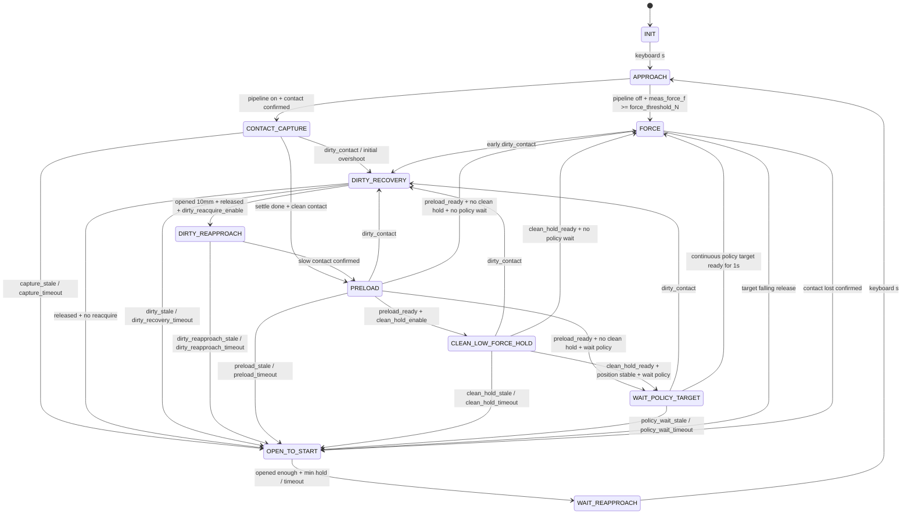

# WSG50 力控状态机 v6：Dirty Contact Recovery 与 Clean Low-Force Handover

日期：2026-07-08

本文档对应新脚本：

```text
wsg50_fsm_force_ctrl_v6.py
```

v6 基于 v5，但改变一个关键判断：

```text
过冲后回到 1N 不是恢复成功。
只有 force、dF/dt、可选触觉/DM 代理都回到 clean low-force contact，才允许交给 policy。
```

---

## 1. v6 相对 v5 的核心变化

v5 的链路是：

```text
APPROACH
  -> CONTACT_CAPTURE
  -> PRELOAD(1N)
  -> WAIT_POLICY_TARGET
  -> FORCE
```

v5 的风险在于：

```text
初接触过冲
  -> force 后续被控回 1N
  -> 但 tactile/DM/contact geometry 仍像高力接触
  -> policy 看到脏接触历史
  -> 输出更高目标力
```

v6 改成：

```text
APPROACH
  -> CONTACT_CAPTURE
  -> PRELOAD(low-force)
  -> CLEAN_LOW_FORCE_HOLD
  -> WAIT_POLICY_TARGET
  -> FORCE

任何接触获取/预加载/交接早期 dirty:
  -> DIRTY_RECOVERY
  -> DIRTY_REAPPROACH
  -> PRELOAD(low-force)
  -> CLEAN_LOW_FORCE_HOLD
  -> WAIT_POLICY_TARGET
  -> FORCE
```

2026-07-08 的 v6.1 改动：dirty/过冲后不再直接退回人工重接近，而是先停住、张开 `dirty_recovery_open_mm=10mm`，再用 `dirty_reapproach_speed_mm_s=2mm/s` 慢速二次接近。二次接近检测到接触后立即停止并进入预加载。

预加载目标按 act 自动选择：

```text
target_force_topic=/znsv6_cmd/act1 -> preload_target_N=1.0
target_force_topic=/znsv6_cmd/act2 -> preload_target_N=1.5
```

如果 topic 被重映射导致无法自动判断，可以显式设置：

```bash
_preload_act_name:=act1
# 或
_preload_act_name:=act2
```

显式设置 `_preload_target_N:=...` 时会覆盖自动目标。

---

## 2. 状态机

```text
INIT
APPROACH
CONTACT_CAPTURE
DIRTY_RECOVERY
DIRTY_REAPPROACH
PRELOAD
CLEAN_LOW_FORCE_HOLD
WAIT_POLICY_TARGET
FORCE
OPEN_TO_START
WAIT_REAPPROACH
```

状态图：

```text
INIT / WAIT_REAPPROACH
  -- s -->
APPROACH
  -- contact confirmed -->
CONTACT_CAPTURE
  -- dirty/overshoot -->
DIRTY_RECOVERY
  -- open 10mm + release/settle -->
DIRTY_REAPPROACH
  -- slow contact confirmed -->
PRELOAD

CONTACT_CAPTURE
  -- no dirty -->
PRELOAD
  -- stable low-force -->
CLEAN_LOW_FORCE_HOLD
  -- clean history + position stable -->
WAIT_POLICY_TARGET
  -- continuous policy target for 1s after enable -->
FORCE

PRELOAD / CLEAN_LOW_FORCE_HOLD / WAIT_POLICY_TARGET / early FORCE
  -- dirty contact -->
DIRTY_RECOVERY
```

补充 Mermaid 状态图：



### 2.1 全局有效性判定

所有状态转换在 30 Hz 主 tick 中执行。每个 tick 先生成一次 snapshot，再基于 snapshot 做状态判断。

```text
target_valid = target_abs_raw_N 存在，且 target_age_s <= target_stale_timeout_s
meas_valid   = meas_force_f_N 存在，且 meas_age_s   <= meas_stale_timeout_s
width_valid  = width_mm 存在，且 width_age_s       <= status_stale_timeout_s
```

默认超时：

```text
target_stale_timeout_s = 0.30
meas_stale_timeout_s   = 0.30
status_stale_timeout_s = 0.50
```

各状态遇到 stale 的处理：

| 状态 | stale 条件 | 行为 |
| --- | --- | --- |
| `APPROACH` | `width_valid=false` 或 `meas_valid=false` | 不继续闭合，只发 debug/warn |
| `CONTACT_CAPTURE` | `width_valid=false` 或 `meas_valid=false` | `OPEN_TO_START(reason="capture_stale")` |
| `DIRTY_RECOVERY` | `width_valid=false` 或 `meas_valid=false` | `OPEN_TO_START(reason="dirty_stale")` |
| `DIRTY_REAPPROACH` | `width_valid=false` 或 `meas_valid=false` | `OPEN_TO_START(reason="dirty_reapproach_stale")` |
| `PRELOAD` | `width_valid=false` 或 `meas_valid=false` | reset PID，`OPEN_TO_START(reason="preload_stale")` |
| `CLEAN_LOW_FORCE_HOLD` | `width_valid=false` 或 `meas_valid=false` | reset PID，`OPEN_TO_START(reason="clean_hold_stale")` |
| `WAIT_POLICY_TARGET` | `width_valid=false` 或 `meas_valid=false` | reset PID，`OPEN_TO_START(reason="policy_wait_stale")` |
| `FORCE` | target/meas/width 任一无效 | reset PID，不发新的 FORCE PID 闭合命令 |
| `OPEN_TO_START` | `width_valid=false` | 不能判定 opened_enough，只能靠 timeout 退出 |

### 2.2 转换条件明细

| 转换 | 触发条件 | 备注 |
| --- | --- | --- |
| `INIT -> APPROACH` | 键盘输入 `s` | 开始低速闭合；policy disable；冻结 baseline（如果启用） |
| `WAIT_REAPPROACH -> APPROACH` | 键盘输入 `s` | 目标力低只 warning，不阻止重新接近 |
| 其他状态按 `s` | 任意非 `INIT/WAIT_REAPPROACH` 状态 | 不切状态，只增加 `ignored_s_count` |
| `APPROACH -> FORCE` | `contact_pipeline_enable=false` 且 `meas_force_f_N >= force_threshold_N` | 旧路径：接触后直接进入 FORCE |
| `APPROACH -> CONTACT_CAPTURE` | `contact_pipeline_enable=true` 且 `meas_force_contact_N >= force_threshold_N` 持续 `force_enter_confirm_s` | v4/v5/v6 接触管线入口 |
| `CONTACT_CAPTURE -> OPEN_TO_START` | `capture_timeout_s` 到期 | reason=`capture_timeout` |
| `CONTACT_CAPTURE -> DIRTY_RECOVERY` | `dirty_now=true` 或初始过冲 | 初始过冲条件：`elapsed <= capture_overshoot_check_s` 且 `meas_force_contact_N >= capture_normal_high_N` |
| `CONTACT_CAPTURE -> PRELOAD` | 已过 `capture_settle_s`，未 stale，未 timeout，未 dirty/overshoot | 进入低力预加载 |
| `DIRTY_RECOVERY -> DIRTY_REAPPROACH` | 张开到 `dirty_recovery_start_width_mm + dirty_recovery_open_mm`，且 release confirmed，且 `dirty_reacquire_enable=true` | 默认路径；v6.1 默认张开 10mm 后慢速二次接近 |
| `DIRTY_RECOVERY -> OPEN_TO_START` | release confirmed 且 `dirty_reacquire_enable=false` | 兼容旧安全路径，reason=`dirty_released_wait_reapproach` |
| `DIRTY_RECOVERY -> OPEN_TO_START` | `dirty_recovery_timeout_s` 到期 | reason=`dirty_recovery_timeout` |
| `DIRTY_REAPPROACH -> PRELOAD` | `meas_force_contact_N >= force_threshold_N` 持续 `dirty_reapproach_contact_confirm_s` | 检测到接触即停止当前位置，再进入预加载 |
| `DIRTY_REAPPROACH -> OPEN_TO_START` | `dirty_reapproach_timeout_s` 到期 | reason=`dirty_reapproach_timeout` |
| `PRELOAD -> DIRTY_RECOVERY` | 预加载期间 dirty | reason 使用 dirty 判据字符串，例如 `force_high,dforce_high` |
| `PRELOAD -> OPEN_TO_START` | `preload_timeout_s` 到期 | reason=`preload_timeout` |
| `PRELOAD -> CLEAN_LOW_FORCE_HOLD` | `preload_ready=true` 且 `clean_hold_enable=true` | 默认 v6 路径 |
| `PRELOAD -> WAIT_POLICY_TARGET` | `preload_ready=true`，`clean_hold_enable=false`，`policy_wait_after_preload_enable=true` | 兼容 v5 路径 |
| `PRELOAD -> FORCE` | `preload_ready=true`，`clean_hold_enable=false`，`policy_wait_after_preload_enable=false` | 不等 policy 新目标，直接进入 FORCE |
| `CLEAN_LOW_FORCE_HOLD -> DIRTY_RECOVERY` | clean hold 期间 dirty | 不允许把脏接触交给 policy |
| `CLEAN_LOW_FORCE_HOLD -> OPEN_TO_START` | `clean_hold_timeout_s` 到期 | reason=`clean_hold_timeout:<clean_reason>` |
| `CLEAN_LOW_FORCE_HOLD -> WAIT_POLICY_TARGET` | `clean_hold_ready=true` 且位置稳定，且 `policy_wait_after_preload_enable=true` | enable policy 并等待 enable 后的新目标 |
| `CLEAN_LOW_FORCE_HOLD -> FORCE` | `clean_hold_ready=true` 且 `policy_wait_after_preload_enable=false` | 直接用 blend/rate limit 接管 |
| `WAIT_POLICY_TARGET -> DIRTY_RECOVERY` | 等 policy 期间 dirty | policy 还没交接就回收 |
| `WAIT_POLICY_TARGET -> OPEN_TO_START` | `policy_wait_timeout_s` 到期 | reason=`policy_wait_timeout` |
| `WAIT_POLICY_TARGET -> FORCE` | `policy_target_ready=true` 持续 `policy_ready_confirm_s` | v6.1 默认 `policy_ready_confirm_s=1.0`，也就是连续收到 1s 推理 topic 后进入 FORCE |
| `FORCE -> DIRTY_RECOVERY` | 进入 FORCE 后前 `force_dirty_monitor_s` 内 dirty | reason 前缀为 `force_handover:` |
| `FORCE -> OPEN_TO_START` | 目标力下降释放触发 | reason 取决于 `release_gate_mode` |
| `FORCE -> OPEN_TO_START` | 失接触确认 | reason=`contact_lost` |
| `OPEN_TO_START -> WAIT_REAPPROACH` | `opened_enough=true` 且已保持 `open_min_hold_s`，或 `open_timeout_s` 到期 | timeout 且没到位时 `open_failed=true` |

`preload_ready` 的条件：

```text
elapsed >= preload_min_hold_s
preload_low_N <= meas_force_contact_N <= preload_high_N
abs(d_contact_force_N_per_s) <= preload_dforce_max_N_per_s
policy_gate_ok = policy_wait_after_preload_enable 或 policy target fresh
以上条件持续 preload_ready_confirm_s
```

`clean_hold_ready` 的条件：

```text
elapsed >= clean_hold_min_s
clean_force_low_N <= meas_force_contact_N <= clean_force_high_N
abs(d_contact_force_N_per_s) <= clean_dforce_max_N_per_s
没有 dirty 判据触发
启用的 tactile/DM clean 检查全部通过
position_stable_now = true
以上条件持续 clean_hold_ready_confirm_s
```

`position_stable_now` 的默认条件：

```text
position_stable_enable = true
position_stable_window_s = 0.50
position_stable_max_span_mm = 0.08
position_stable_min_samples = 5

在最近 position_stable_window_s 内：
  width_mm 最大值 - 最小值 <= position_stable_max_span_mm
  样本数 >= position_stable_min_samples
```

`policy_target_ready` 的条件：

```text
target_abs_raw_N 存在
target_age_s <= policy_target_stale_s
如果 policy_require_target_after_enable=true:
  target_stamp_s > policy_enable_time_s + policy_target_after_enable_margin_s
以上条件持续 policy_ready_confirm_s
```

v6.1 默认：

```text
policy_ready_confirm_s = 1.0
```

这表示不是收到第一帧推理 target 就进入 FORCE，而是 policy enable 之后，目标 topic 必须连续保持 fresh 约 1s。若 topic 中断超过 `policy_target_stale_s`，确认计时会清零。

### 2.3 FORCE 中张开触发

FORCE 状态下先检查 early dirty，再检查目标力下降释放，再检查失接触，最后才运行 PID。

目标力下降趋势只在收到新的 target 样本时更新，避免 30 Hz FSM tick 重复喂同一个目标力样本。

趋势确认的默认条件：

```text
trend_open_enable = true
trend_window_s = 0.6
trend_min_window_s = 0.35
trend_min_samples = 10
trend_min_start_N = 0.8
trend_min_drop_N = 0.55
trend_min_drop_frac = 0.12
trend_min_slope_N_per_s = 1.0
trend_min_neg_mag_ratio = 0.70
trend_min_efficiency = 0.45
trend_confirm_s = 0.08
```

趋势确认后会锁存 `release_intent_latched`，有效期 `release_intent_timeout_s`，默认 `1.5s`。真正是否张开由 `release_gate_mode` 决定：

| release_gate_mode | FORCE -> OPEN_TO_START 条件 | reason |
| --- | --- | --- |
| `trend_only` | trend confirmed，target 有效，默认还要求 meas 有效，shape guard 允许 | `target_falling` |
| `trend_and_target_low` | `trend_only` 条件 + target low confirmed | `falling_and_target_low` |
| `trend_and_low_force` | `trend_only` 条件 + target low confirmed + measured low confirmed | `falling_and_low_force` |
| `trend_and_release_shape` | trend confirmed，target 有效，默认还要求 meas 有效，shape guard 允许 | `target_falling_shape` |

其中 `trend_release_require_meas_valid=true` 是默认值，`trend_release_require_status_valid=false` 是默认值；如果把后者设为 true，trend release 还会要求 width/status 有效。

shape guard 默认是 `warn`：只报警，不阻止张开。设为 `enforce` 时，如果启用的形状约束失败，会阻止这次 trend release。

```text
trend_shape_guard_mode = off / warn / enforce
trend_use_end_cap:
  end_level_N <= trend_max_end_N
trend_use_min_drop_frac_high_force:
  start_level_N >= trend_high_force_start_N 时，
  drop_frac >= trend_min_drop_frac_high_force
```

失接触触发：

```text
force_contact_lost_to_open_enable = true
进入 FORCE 后先等待 force_contact_lost_grace_s
lost_check_force_N < force_contact_lost_threshold_N
以上条件持续 force_contact_lost_confirm_s
```

默认：

```text
force_contact_lost_threshold_N = 0.5 * force_threshold_N
force_contact_lost_grace_s = 0.25
force_contact_lost_confirm_s = 0.30
```

### 2.4 张开和等待重接近

`OPEN_TO_START` 持续向 `open_target_width_mm` 张开。到位判断：

```text
opened_enough = width_valid 且 width_mm >= open_target_width_mm - open_width_tol_mm
```

转入 `WAIT_REAPPROACH` 的条件：

```text
(opened_enough 且 now - open_enter_time_s >= open_min_hold_s)
或 now - open_enter_time_s >= open_timeout_s
```

如果 timeout 时仍未到位：

```text
open_failed = true
```

`WAIT_REAPPROACH` 会保持张开并周期性重发 open command。按 `s` 后重新进入 `APPROACH`；如果目标力低于 `low_target_reapproach_warn_N`，只打印 warning，不阻止动作。

---

## 3. Dirty Contact 判据

默认启用：

```text
dirty_recovery_enable = true
```

基础 dirty 判据：

```text
meas_force_contact_N >= dirty_hard_force_N
或 d_contact_force_N_per_s >= dirty_dforce_limit_N_per_s
```

默认：

```text
dirty_hard_force_N = capture_normal_high_N
dirty_dforce_limit_N_per_s = 8.0
```

可选触觉/DM 代理话题：

```text
/DM/depth_ssim
/DM/slip_region_num
/DM/sparse_shear
/DM/sparse_deformation
```

对应阈值默认都是 `-1`，表示不启用。需要时可以显式打开：

```bash
_dirty_slip_region_limit:=3 \
_dirty_shear_mean_abs_limit:=0.08 \
_dirty_deformation_mean_abs_limit:=0.08 \
_dirty_tactile_diff_mean_abs_limit:=0.05
```

如果配置了 clean 阈值，则 handover 前必须等这些信号新鲜且通过。

---

## 4. Dirty Recovery 逻辑

进入 `DIRTY_RECOVERY` 后：

```text
policy_enable = false
reset PID integral
stop at current width
open width by dirty_recovery_open_mm
wait dirty_recovery_settle_s
```

默认恢复条件：

```text
width_mm >= dirty_recovery_start_width_mm + dirty_recovery_open_mm - dirty_recovery_width_tol_mm
meas_force_contact_N <= dirty_release_force_N
abs(d_contact_force_N_per_s) <= dirty_release_dforce_max_N_per_s
持续 dirty_release_confirm_s
```

默认动作：

```text
DIRTY_RECOVERY release 后进入 DIRTY_REAPPROACH。
```

v6.1 默认参数：

```text
dirty_recovery_open_mm = 10.0
dirty_recovery_open_speed_mm_s = 8.0
dirty_recovery_width_tol_mm = 0.3
dirty_recovery_settle_s = 0.25
dirty_recovery_timeout_s = 5.0
dirty_reacquire_enable = true
```

如果希望保持旧的“dirty 后回到打开等待人工重接近”，可以设置：

```bash
_dirty_reacquire_enable:=false
```

`DIRTY_REAPPROACH` 逻辑：

```text
以 dirty_reapproach_speed_mm_s 慢速闭合
meas_force_contact_N >= force_threshold_N 时立即停止当前位置
接触持续 dirty_reapproach_contact_confirm_s 后进入 PRELOAD
dirty_reapproach_timeout_s 到期则 OPEN_TO_START
```

默认：

```text
dirty_reapproach_speed_mm_s = 2.0
dirty_reapproach_contact_confirm_s = force_enter_confirm_s
dirty_reapproach_timeout_s = 8.0
```

---

## 5. Clean Low-Force Handover

v6.1 默认预加载目标按 act 自动选择：

```text
/znsv6_cmd/act1 -> preload_target_N = 1.0
/znsv6_cmd/act2 -> preload_target_N = 1.5
preload_low_N = preload_target_N - preload_band_N
preload_high_N = preload_target_N + preload_band_N
preload_band_N = 0.20
```

PRELOAD 稳定后不会直接 enable policy，而是进入：

```text
CLEAN_LOW_FORCE_HOLD
```

默认 clean 条件：

```text
clean_force_low_N <= meas_force_contact_N <= clean_force_high_N
abs(d_contact_force_N_per_s) <= clean_dforce_max_N_per_s
没有 dirty 判据触发
position_stable_now = true
持续 clean_hold_min_s + clean_hold_ready_confirm_s
```

默认：

```text
clean_hold_min_s = 0.6
clean_hold_ready_confirm_s = 0.25
clean_hold_timeout_s = 6.0
```

这样做的目的不是“把力控准”，而是确保 policy 的 observation horizon 里不包含刚才的过冲/脏接触帧。

上面的推荐启动命令是 act2 示例。如果跑 act1，至少改成：

```bash
_measured_force_topic:=/znsv6_data_sensor1 \
_target_force_topic:=/znsv6_cmd/act1 \
_preload_act_name:=act1 \
_dirty_hard_force_N:=1.5
```

---

## 6. FORCE 早期 Envelope

进入 FORCE 后，v6 仍保留 v5 的 policy blend，但在接管早期增加目标力上限：

```text
handover_target_cap_enable = true
handover_target_cap_N = 1.0
force_dirty_monitor_s = 1.5
```

含义：

```text
blend 未完成时，即使 policy 第一帧目标力偏高，也先夹到 handover_target_cap_N。
FORCE 前 force_dirty_monitor_s 秒内如果再次 dirty，直接 DIRTY_RECOVERY。
```

---

## 7. 推荐启动命令

```bash
cd ~/catkin_ws
source devel/setup.bash

rosrun wsg_50_driver wsg50_fsm_force_ctrl_v6.py \
  _goal_position_topic:=/wsg_50_driver/goal_position \
  _status_topic:=/wsg_50_driver/status \
  _measured_force_topic:=/znsv6_data_sensor2 \
  _measured_force_index:=0 \
  _target_force_topic:=/znsv6_cmd/act2 \
  _target_force_index:=0 \
  _debug_topic:=/debug \
  _target_ctrl_topic:=/wsg50_fsm_force_ctrl/target_ctrl \
  _policy_enable_topic:=/wsg50_fsm_force_ctrl/policy_enable \
  _contact_pipeline_enable:=true \
  _force_threshold_N:=0.15 \
  _capture_backoff_enable:=true \
  _capture_backoff_mm:=0.10 \
  _capture_backoff_speed_mm_s:=4.0 \
  _dirty_recovery_enable:=true \
  _dirty_hard_force_N:=2.0 \
  _dirty_dforce_limit_N_per_s:=8.0 \
  _dirty_recovery_open_mm:=10.0 \
  _dirty_recovery_open_speed_mm_s:=8.0 \
  _dirty_recovery_width_tol_mm:=0.3 \
  _dirty_recovery_settle_s:=0.25 \
  _dirty_recovery_timeout_s:=5.0 \
  _dirty_release_force_N:=0.12 \
  _dirty_release_dforce_max_N_per_s:=0.25 \
  _dirty_release_confirm_s:=0.25 \
  _dirty_reacquire_enable:=true \
  _dirty_reapproach_speed_mm_s:=2.0 \
  _dirty_reapproach_timeout_s:=8.0 \
  _preload_act_name:=act2 \
  _preload_band_N:=0.20 \
  _preload_timeout_s:=20.0 \
  _preload_min_hold_s:=0.5 \
  _preload_ready_confirm_s:=0.5 \
  _preload_kp_mm_per_N:=0.10 \
  _preload_speed_mm_s:=2.0 \
  _preload_dforce_max_N_per_s:=0.4 \
  _clean_hold_enable:=true \
  _clean_hold_min_s:=0.6 \
  _clean_hold_ready_confirm_s:=0.25 \
  _clean_hold_timeout_s:=6.0 \
  _position_stable_enable:=true \
  _position_stable_window_s:=0.50 \
  _position_stable_max_span_mm:=0.08 \
  _policy_wait_after_preload_enable:=true \
  _policy_wait_timeout_s:=5.0 \
  _policy_ready_confirm_s:=1.0 \
  _policy_require_target_after_enable:=true \
  _policy_reset_target_filter_on_enable:=true \
  _handover_target_cap_enable:=true \
  _handover_target_cap_N:=1.0 \
  _force_dirty_monitor_s:=1.5 \
  _policy_blend_s:=4.0 \
  _target_rise_rate_N_per_s:=0.2 \
  _target_fall_rate_N_per_s:=2.0 \
  _target_force_lpf_alpha:=0.1 \
  _target_scale:=1.0 \
  _pid_speed_mm_s:=3.0 \
  _kp_mm_per_N:=0.08 \
  _ki_mm_per_Ns:=0.0 \
  _kd_mm_per_Ns:=0.0 \
  _pos_eps_mm:=0.005 \
  _cmd_min_period_s:=0.015 \
  _min_speed_mm_s:=1.0 \
  _debug_period_s:=0.05
```

---

## 8. 调试字段

看 `/debug`：

```bash
rostopic echo /debug
```

重点字段：

```text
state=DIRTY_RECOVERY
dirty_contact=True
dirty_now=True/False
dirty_reason=force_high,dforce_high,...
clean_now=True/False
clean_reason=ok/force_unstable/...
clean_hold_ready=True/False
policy_enabled=True/False
policy_target_ready=True/False
target_ctrl_blend=...
```

判断原则：

```text
如果 dirty_contact=True，默认必须重新接近。
如果 clean_now=False，不应该 enable policy。
如果 FORCE 前 1.5s 又 dirty，说明 handover 仍然太猛，需要降 preload、降 handover cap 或加大 open/reseat。
```
